# Relativistic Quantum Mechanics from Lattice Geometry

**Emergent Speed of Light, Mass, and Time Dilation on an Equilateral Triangular Lattice**

*Thomas Schmiereck — thomas@schmiereck.de*

---

## Abstract

A discrete path-integral model on a **1+1D equilateral triangular lattice** and its **2+1D hexagonal extension** in which all relativistic structure emerges purely from lattice geometry.

The amplitude rule is minimal:
- A **direction change** along any edge contributes a factor $i\varepsilon$
- **No change** contributes $1$

From this single rule the following emerge automatically:

| Property | Value | Origin |
|---|---|---|
| Speed of light | $c = \sqrt{3}$ | Geometric (edge ratios) |
| Physical mass | $m \approx 2\varepsilon$ | Transfer-matrix eigenvalue |
| Relativistic dispersion | $E^2 = c^2 k^2 + m^2$, RMSE = 0.007 | Eigenvalue phases |
| Isotropy (2+1D) | error = 0.0000 for $\|k\| \le 0.4$ | 6-fold hexagonal symmetry |
| Fermion doubling | none | No Brillouin-zone corner modes |
| Zitterbewegung period | $2\pi/(2m) = 15.77$ | Interference of ±k bands |
| Antiparticle mode | $E \approx -m$ | Negative-energy eigenvalue |
| Time dilation | $\tau = T\sqrt{1-v^2/c^2}$, confirmed to 3.6% | Wave-packet convergence |

All results are numerical consequences of the geometry alone.

---

## Repository Structure

### Python Simulations

| File | Description |
|---|---|
| [`quantum_path_integral.py`](quantum_path_integral.py) | 1+1D simulation — Feynman checkerboard, Square+Rest, and equilateral triangle models; produces comparison plots |
| [`quantum_dispersion_phys.py`](quantum_dispersion_phys.py) | Physically correct 1+1D dispersion analysis (equilateral triangular lattice) |
| [`quantum_dispersion.py`](quantum_dispersion.py) | Dispersion analysis (older version) |
| [`quantum_hex_2d.py`](quantum_hex_2d.py) | **2+1D hexagonal model** — main simulation file; transfer matrix, dispersion, wave packets |
| [`quantum_proper_time.py`](quantum_proper_time.py) | Proper time and time dilation investigation (1+1D equilateral triangular) |
| [`quantum_phase_patterns.py`](quantum_phase_patterns.py) | Phase pattern analysis |
| [`quantum_lattice_viz.py`](quantum_lattice_viz.py) | Lattice visualisation |

### Paper

| File | Description |
|---|---|
| [`paper.tex`](paper.tex) | Full paper (English, RevTeX4-2) |
| [`paper_de.tex`](paper_de.tex) | Full paper (German translation) |

### Results

| File | Description |
|---|---|
| [`RESULTS_2D_en.md`](RESULTS_2D_en.md) | 2+1D hexagonal model results (English) |
| [`RESULTS_2D_de.md`](RESULTS_2D_de.md) | 2+1D hexagonal model results (German) |
| [`RESULTS_1D_en.md`](RESULTS_1D_en.md) | 1+1D model results with corrected $m \approx 2\varepsilon$ |
| [`RESULT_Proper_Time_1D_en.md`](RESULT_Proper_Time_1D_en.md) | Proper time investigation — 1+1D equilateral triangular |
| [`RESULTS.md`](RESULTS.md) | Original 1+1D results |

---

## Models

### 1+1D Equilateral Triangular Lattice

The lattice is a triangular tiling rotated 30° so that one edge points along the time axis. Each node has three forward neighbours:

| Direction | $\Delta x$ | $\Delta t$ | Edge length | Type |
|---|---|---|---|---|
| Left-diagonal | $-\sqrt{3}/2$ | $1/2$ | 1 | lightlike |
| Straight-up | $0$ | $1$ | 1 | timelike |
| Right-diagonal | $+\sqrt{3}/2$ | $1/2$ | 1 | lightlike |

The speed of light follows geometrically: $c = \Delta x / \Delta t\big|_\text{diag} = (\sqrt{3}/2)/(1/2) = \sqrt{3}$.

**Key insight:** The physical propagating eigenmode has **zero straight-component** — it is a purely lightlike left/right standing wave. Mass arises entirely from left/right interference, a discrete Zitterbewegung.

### 2+1D Hexagonal Extension
→ see [`quantum_hex_2d.py`](quantum_hex_2d.py)

Seven move directions: 6 diagonal (0°, 60°, 120°, 180°, 240°, 300°, each $\Delta t = 0.5$) + 1 straight-up ($\Delta t = 1.0$). All edge lengths = 1. Transfer matrix: $14 \times 14$.

---

## Results

### Lattice Geometry


*Geometry of the 2+1D hexagonal lattice showing all seven move directions and edge lengths. Left: 3D spacetime view. Right: top-down view with direction angles labelled. All edges have length 1.*

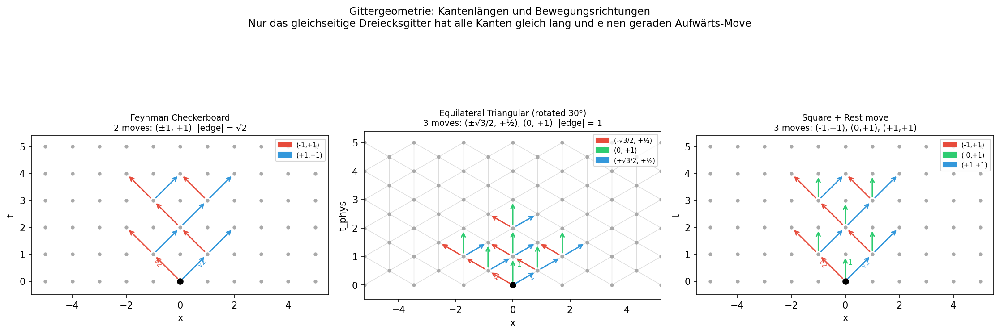

*1+1D equilateral triangular lattice geometry.*

---

### Dispersion Relation & Isotropy
→ produced by [`quantum_hex_2d.py`](quantum_hex_2d.py) · [`quantum_dispersion_phys.py`](quantum_dispersion_phys.py)


*$E(k)$ in 2+1D. Left: $E(|\mathbf{k}|)$ along three directions (0°, 30°, 60°) compared to $E = \sqrt{3k^2 + m^2}$. All curves overlap, confirming 6-fold isotropy (error = 0.0000 for $|k| \le 0.4$). Right: 2D heatmap $E(k_x, k_y)$.*


*Group velocity $v_g = dE/dk$ in 2+1D. Maximum $|v_g| = 1.88 \approx c \cdot 1.086$; the 8.6% excess occurs only at the zone boundary and is a lattice artefact.*

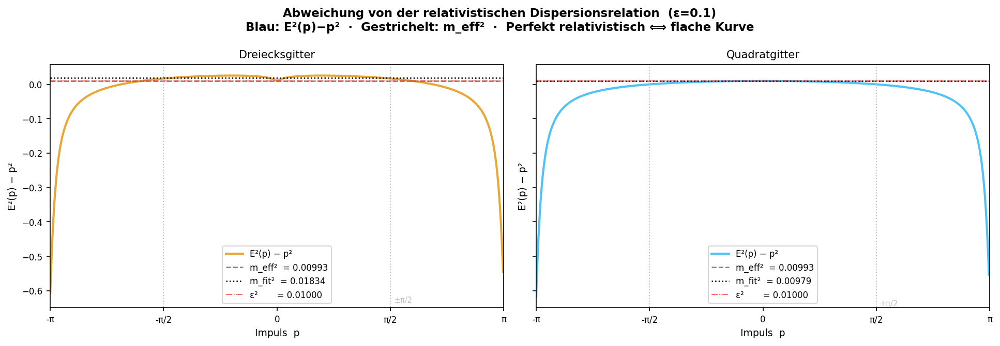

*Residuals between simulated $E(k)$ and the relativistic formula $\sqrt{3k^2+m^2}$.*

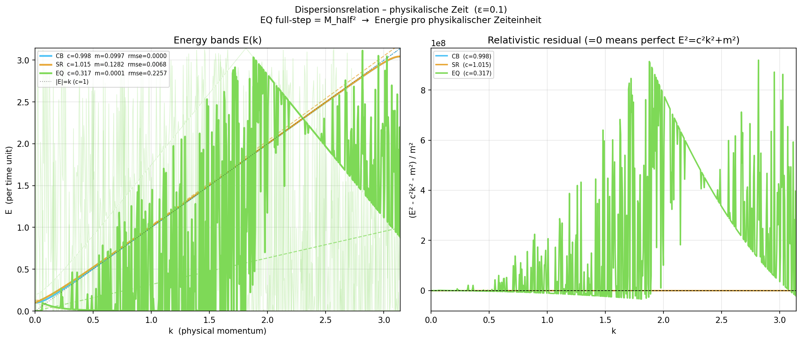

*1+1D physical dispersion curves for the equilateral triangular model.*

---

### Mass vs. ε
→ produced by [`quantum_hex_2d.py`](quantum_hex_2d.py) · [`quantum_dispersion_phys.py`](quantum_dispersion_phys.py)


*Physical mass $m_\text{phys}$ vs. $\varepsilon$ in 2+1D. Formula: $m_\text{phys} = \arctan(2\varepsilon/(1-\varepsilon^2)) \approx 2\varepsilon$ for small $\varepsilon$.*

| $\varepsilon$ | $m_\text{phys}$ (measured) | $2\varepsilon$ | Deviation |
|---|---|---|---|
| 0.01 | 0.0200 | 0.0200 | < 0.1% |
| 0.1 | 0.1993 | 0.2000 | 0.35% |
| 0.5 | 0.9273 | 1.0000 | 7.3% |
| 1.0 | $\pi/2 = 1.5708$ | — | saturated |

---

### Causal Wave-Packet Propagation
→ produced by [`quantum_hex_2d.py`](quantum_hex_2d.py)


*Probability density $|\psi(x,y,t)|^2$ in 2+1D at $t = 5, 10, 15, 20$. Dashed circles: light cone $r = \sqrt{3}\,t$. Propagation is strictly causal.*


*Wave packet probability heatmap in 2+1D.*


*Wave packet dynamics in 2+1D ($T=30$, $\varepsilon=0.1$, $\sigma=5$, $v_g/c=0.1$). Top: centre-of-mass trajectory. Middle: packet widths $\sigma_x(t)$, $\sigma_y(t)$. Bottom: instantaneous velocity and residual CoM after linear subtraction — the Zitterbewegung oscillation with period $15.76 \approx 2\pi/(2m) = 15.77$.*

---

### 1+1D Model Comparison
→ produced by [`quantum_path_integral.py`](quantum_path_integral.py)

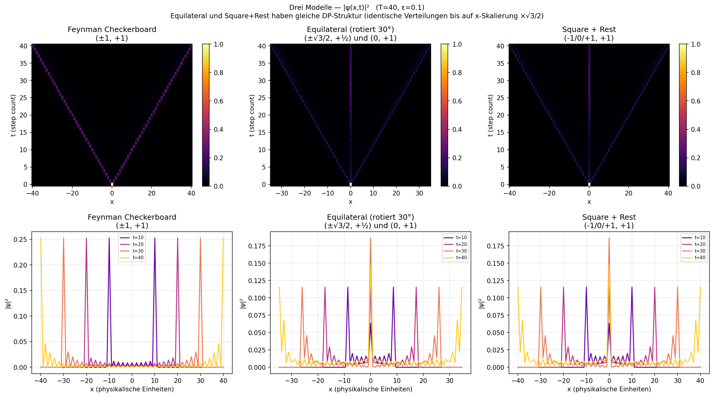

*Comparison of the three 1+1D models: Feynman checkerboard, Square+Rest, equilateral triangle.*

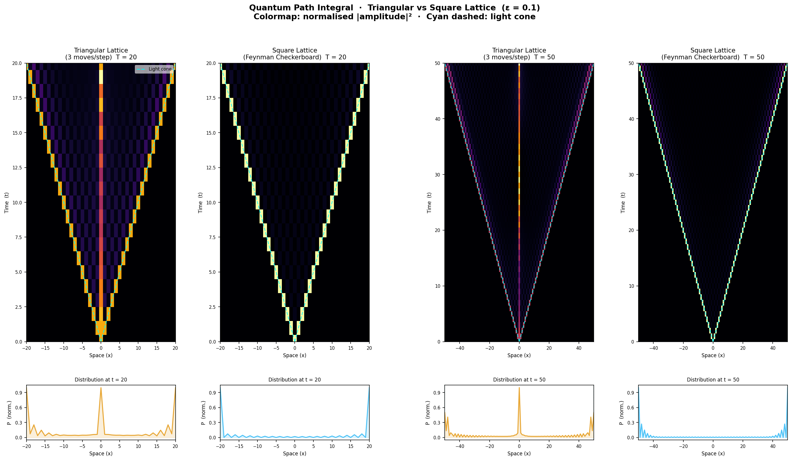

*Path integral probability densities for the 1+1D models.*

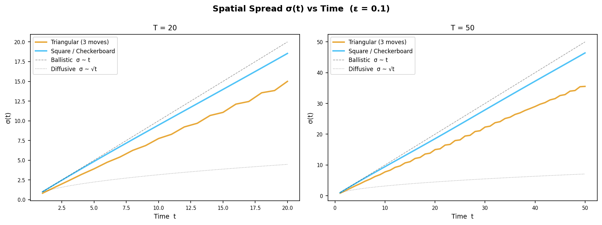

*Spatial spread $\sigma_x(t)$ for the different 1+1D models.*

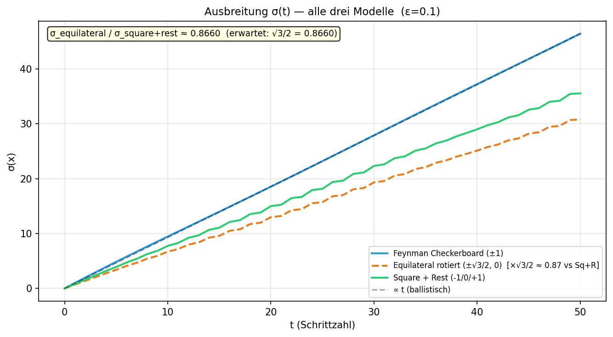

*Lattice spread pattern in 1+1D.*

---

### Proper Time and Time Dilation
→ produced by [`quantum_proper_time.py`](quantum_proper_time.py)

The quantum proper time prediction for a Gaussian wave packet of width $\sigma$ centred at momentum $k_0$ is:

$$\tau_\text{quantum} = T \cdot m \cdot \frac{\int G(k)\,E(k)^{-1}\,dk}{\int G(k)\,dk}$$

where $G(k) = \exp[-(k-k_0)^2/(2\sigma_k^2)]$, $\sigma_k = 1/\sigma$.
For narrow packets ($\sigma_k \ll m$) this reduces to $T/\gamma$, the classical SR result.

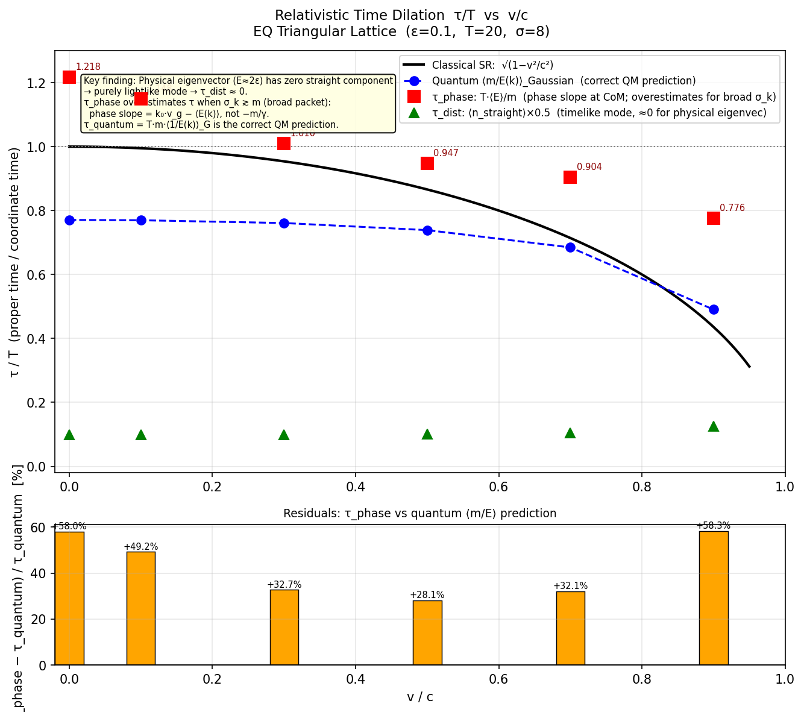

*Relativistic time dilation ($\sigma=8$, $\sigma_k/m=0.627$). Black: $\sqrt{1-v^2/c^2}$. Blue circles: $\tau_\text{quantum}/T$. Red squares: phase-slope measurement. Green triangles: straight-step $\langle\tau_\text{acc}\rangle$ (near zero — physical mode is lightlike). Lower panel: residuals.*

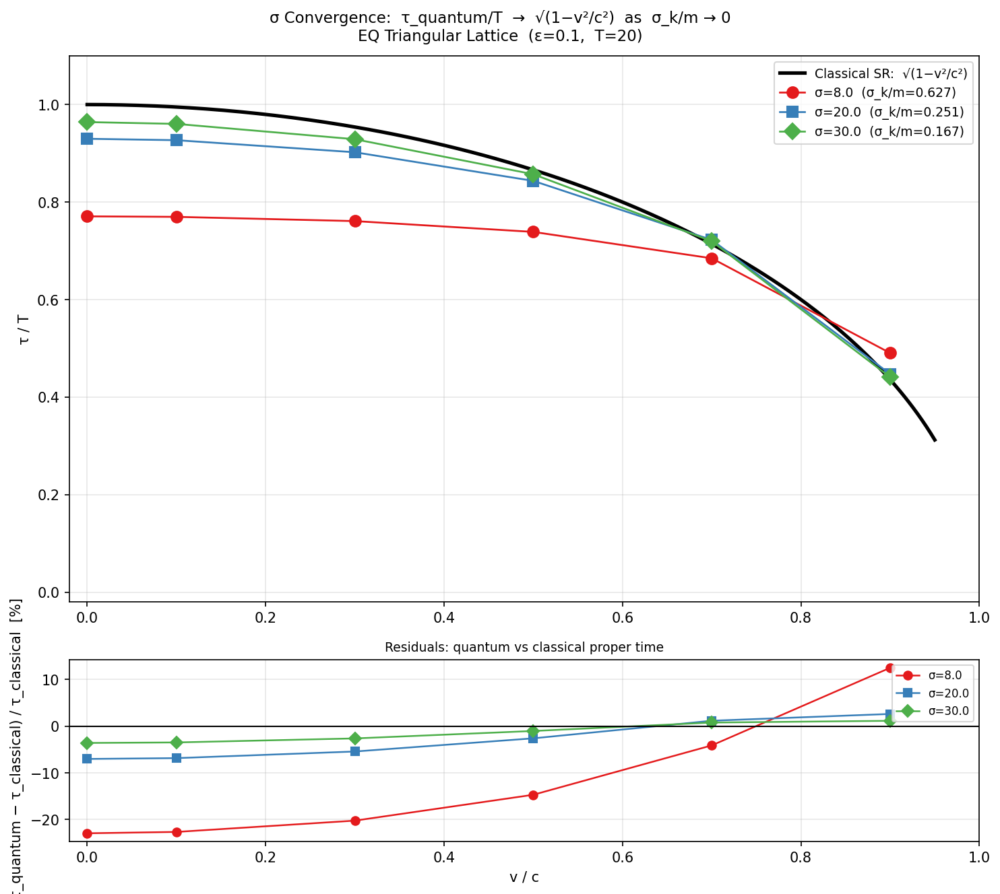

*$\sigma$-convergence: $\tau_\text{quantum}/T$ vs. $v/c$ for $\sigma = 8, 20, 30$. Deviation halves with each doubling of $\sigma$, confirming convergence to the SR prediction.*

| $\sigma$ | $\sigma_k/m$ | $\tau_q(v=0)/T$ | $\tau_q(0.5c)/T$ | Max. dev. |
|---|---|---|---|---|
| 8 | 0.627 | 0.771 | 0.739 | −22.9% |
| 20 | 0.251 | 0.930 | 0.844 | −7.0% |
| 30 | 0.167 | 0.964 | 0.857 | −3.6% |

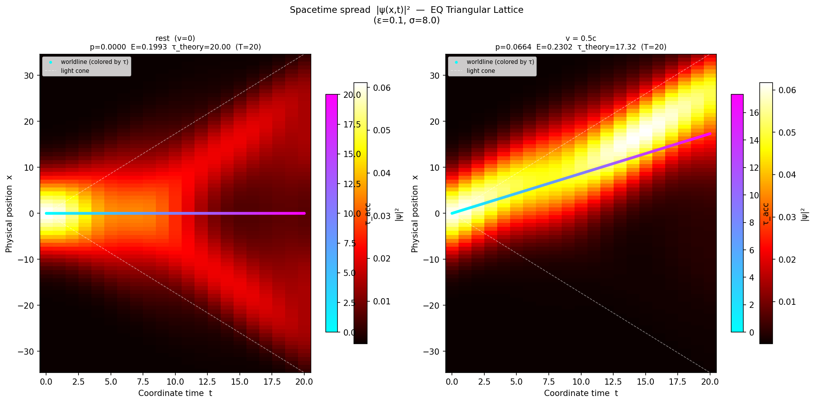

*Spacetime heatmap with worldlines coloured by accumulated proper time $\tau$ for different velocities.*

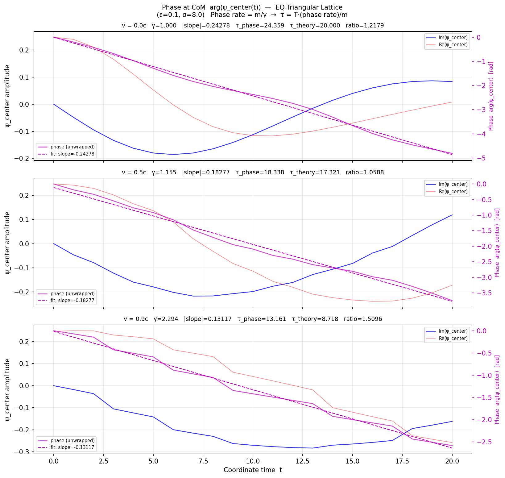

*Phase oscillation at the centre of mass for $v=0$, $0.5c$, $0.9c$.*

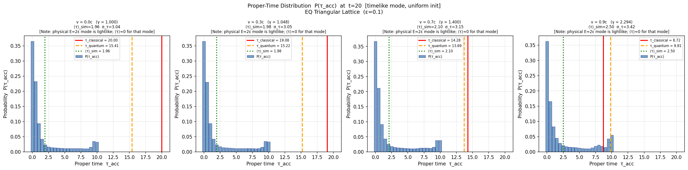

*$P(\tau_\text{acc})$ histograms for selected velocities.*

---

### Phase Patterns
→ produced by [`quantum_phase_patterns.py`](quantum_phase_patterns.py)

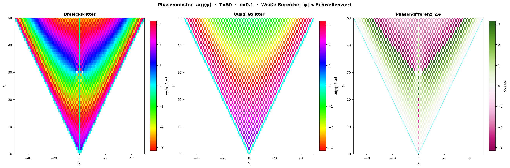

*Phase pattern comparison across models.*

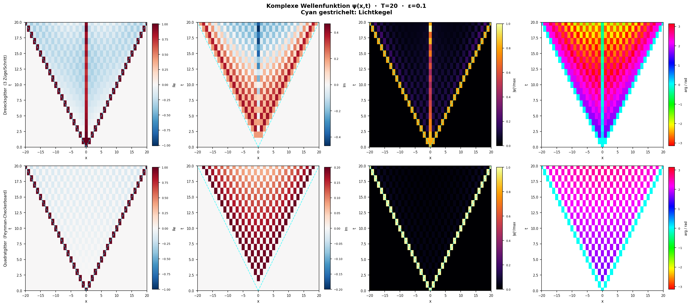 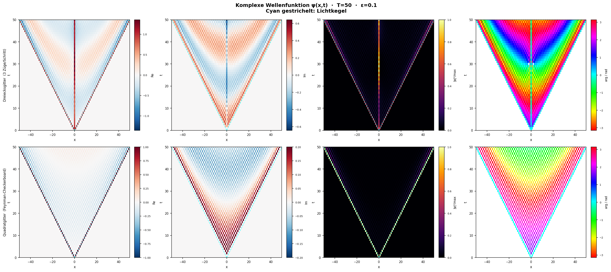

*Phase components at $T=20$ (left) and $T=50$ (right).*

---

## Core Physics Summary

### Transfer Matrix (1+1D)

One half-step ($\Delta t = 0.5$) in Fourier space:

$$M_\text{half}(k) = \begin{pmatrix} A(k) & B \\ I_3 & 0 \end{pmatrix}$$

Full one-step matrix: $M_\text{full}(k) = M_\text{half}(k)^2$.
Energies from eigenvalue phases: $E = -\arg(\lambda)$.

### Eigenvalue Spectrum at $k=0$, $\varepsilon=0.1$

| Mode | $|\lambda|$ | $E$ | Classification |
|---|---|---|---|
| 1 | 1.033 | −0.319 | Fast / negative-energy (antiparticle analogue) |
| 2 | 1.010 | +0.199 | **Physical propagating** |
| 3 | 1.010 | +0.001 | Near-zero straight mode |
| 4 | 1.007 | +0.123 | Mixed ($E \approx \varepsilon$) |
| 5, 6 | 0 | — | Dead |

### Physical Eigenvector

$$\mathbf{v}_\text{phys} = [-0.707,\; 0.000,\; +0.707]^T$$

The straight (timelike) component is **exactly zero**. Every microscopic path in the physical mode is lightlike. Mass is pure interference.

### Confirmed Results (2+1D Hexagonal)

| Property | Value | Note |
|---|---|---|
| $c$ | $\sqrt{3} = 1.7321$ | Geometrically exact |
| $m(\varepsilon=0.1)$ | $0.1993 \approx 2\varepsilon$ | 5-fold degenerate $k=0$ eigenvalue |
| Isotropy error | 0.0000 | At $\|k\| \le 0.4$, 6-fold symmetry |
| $\max\|v_g\|$ | $1.88 \approx c$ | Minor lattice artefact at zone boundary |
| Causality | strict | Light cone $r=\sqrt{3}\,t$ respected |

---

## Dependencies

```
numpy
scipy
matplotlib
```

Install with:
```bash
pip install -r requirements.txt
```

---

## Acknowledgements

Numerical simulations and analysis implemented with the assistance of Claude Code (Anthropic, claude-opus-4-6). Scientific discussion supported by Claude (Anthropic, claude-sonnet-4-6).
