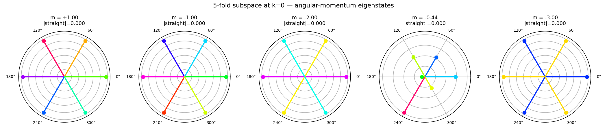
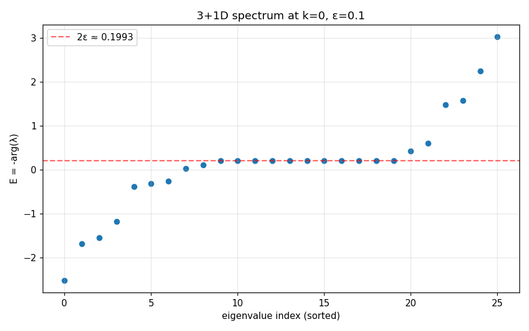
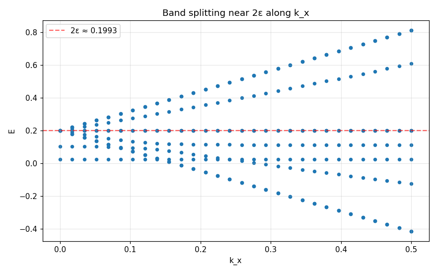
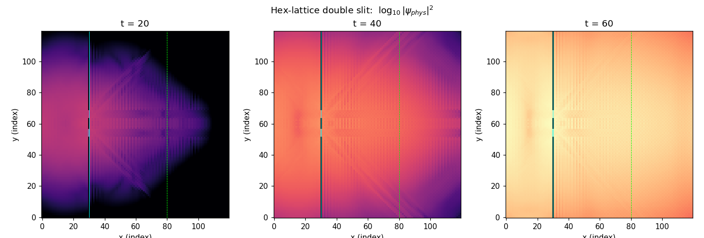
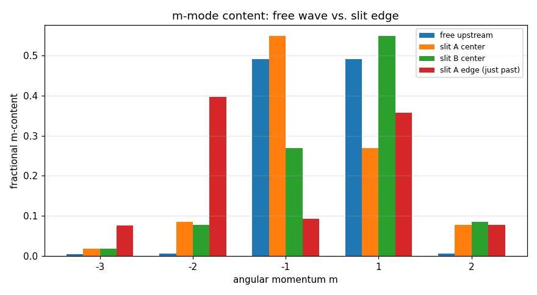
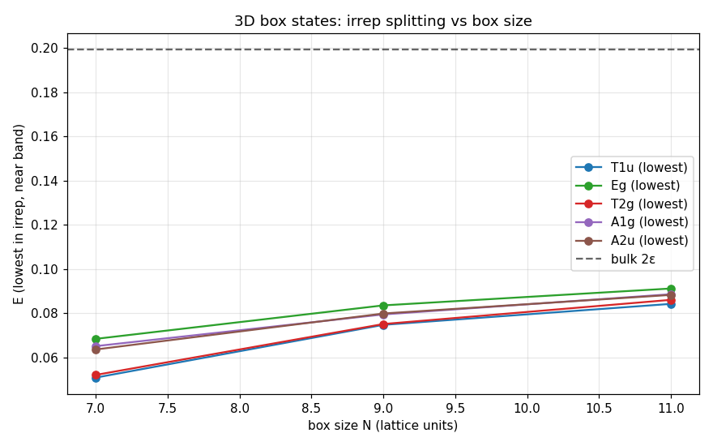

# Internal Structure of the Equilateral Lattice Path Integral

**Crystal Angular Momentum, Emergent Vector Ground State, and Symmetry Breaking by Confinement**

*Thomas Schmiereck — thomas@schmiereck.de*

follow-up to [`paper.tex`](paper.tex) / [`paper.pdf`](paper.pdf) / [`README1_lattice_geometry.md`](README1_lattice_geometry.md)

LaTeX version: [`paper2_internal_structure.tex`](paper2_internal_structure.tex)  
PDF version: [`paper2_internal_structure.pdf`](paper2_internal_structure.pdf)

---

## Abstract

In a previous paper we showed that an equilateral triangular (1+1D) and
hexagonal (2+1D) path-integral lattice with the single amplitude rule
"direction change = iε" reproduces relativistic dispersion, exact isotropy
and the speed of light c = √3 from geometry alone. Here we analyse the
**internal structure** of the physical propagating band of the same model,
in 2+1D and in a natural 3+1D tetrahedral-octahedral (cuboctahedron)
extension.

- **2+1D:** the physical band is exactly 5-fold degenerate and decomposes
  under C₆ᵥ as **E₁ ⊕ E₂ ⊕ B**, carrying crystal angular momenta
  m ∈ {±1, ±2, +3} mod 6. The s-wave is excluded by a **factor-6** spectral
  gap in the local coupling matrix.
- **3+1D:** the band is exactly 11-fold degenerate and decomposes under
  Oₕ as **E_g ⊕ T₂_g ⊕ T₁_u ⊕ T₂_u**, with exclusion factor **12**.
- **General law:** for N lightlike diagonal directions the band has
  dimension N−1 and λ_C(s-wave) = 1 + N·iε.
- A numerical **double-slit** experiment shows a free wave packet is
  **98 % T₁u (vector)**.
- A 3+1D **hard-wall box** calculation places T₁u consistently lowest in
  energy, with the T₁u–E_g gap following **1/L² to within 2 %**.

Vector physics emerges geometrically as the preferred ground state of the
lattice.

---

## 1. Introduction

Paper 1 ([`paper.tex`](paper.tex), ([`paper.pdf`](paper.pdf), [`README1_lattice_geometry.md`](README1_lattice_geometry.md)) introduced an
equilateral path-integral lattice in which every edge has length one, a
single amplitude rule assigns a factor iε to every direction change and 1
to every straight continuation, and all relativistic structure (c = √3,
m_phys ≈ 2ε, relativistic dispersion, time dilation, exact 6-fold
isotropy, no fermion doubling) emerges directly from the geometry.

One feature of the 2+1D analysis was left **open** in paper 1: the
physical propagating band at k = 0 is exactly 5-fold degenerate, but its
representation-theoretic content and physical meaning were not identified.

This paper answers that question and extends the analysis to a 3+1D
face-centred-cubic (cuboctahedron) lattice. Three results emerge:

1. **The physical band is always the traceless part of the direction-space
   Fourier representation.** Its dimension is one less than the number N
   of lightlike diagonal directions, and the excluded state is the s-wave.
   The mechanism is a spectral gap in the local coupling matrix C: the
   s-wave gets eigenvalue 1 + N·iε, every orthogonal Fourier mode gets
   1 − iε, and the factor-N imbalance banishes the s-wave to a different
   band.
2. **In 3+1D the physical band decomposes under Oₕ as
   E_g ⊕ T₂_g ⊕ T₁_u ⊕ T₂_u**, and the "vector" irrep T₁u dominates free
   propagation (98 % of a wave packet) and sits lowest in energy in a
   hard-wall box.
3. **Higher angular-momentum content** (in particular the d-wave m = ±2
   in 2+1D) is only excited at obstructions such as slit edges, where it
   can reach ~47 % of the local amplitude.

The equilateral lattice geometrically prefers a **vector field** as its
low-energy sector — suggestive in view of the fact that every fundamental
interaction in the Standard Model (photon, W±, Z, gluons) is mediated by
a spin-1 vector boson.

---

## 2. Crystal angular momentum in 2+1D

*Scripts:* [`quantum_spin_structure.py`](quantum_spin_structure.py),
[`quantum_spin_cluster.py`](quantum_spin_cluster.py),
[`quantum_mzero_check.py`](quantum_mzero_check.py)

### 2.1 Symmetry group C₆ᵥ

The full one-step transfer matrix M_full(k) = M_half² of the 2+1D
hexagonal lattice acts on a 14-dimensional state (7 direction amplitudes
current, 7 previous). At k = 0 it is exactly invariant under the
crystallographic point group C₆ᵥ (order 12):

```
max ‖[M_full, R(g)]‖ over all 12 group elements < 10⁻¹⁰
```

### 2.2 Decomposition of the physical band

The 14-dim state space decomposes into C₆ᵥ irreps as

> 4·A₁ ⊕ 2·B₁ ⊕ 2·E₁ ⊕ 2·E₂

and the 5-fold-degenerate physical band at E = m_phys = arctan(2ε/(1−ε²))
carries exactly the **traceless part**

> **Physical band (2+1D) = E₁ ⊕ E₂ ⊕ B**   (dim = 2 + 2 + 1 = 5)

All five eigenvectors share the eigenvalue λ = (1−ε²) − 2iε, giving
|λ| = 1 + ε² and E = m_phys ≈ 2ε. Joint diagonalisation of M_full and
the 60° rotation R₆₀ labels the modes by crystal angular momentum

> m ∈ { −2, −1, +1, +2, +3 }   (mod 6)

so the s-wave m = 0 (A₁) is absent. In each mode the straight (timelike)
component is identically zero — the physical states are pure
superpositions of the six lightlike diagonals.



*Figure: the five band eigenvectors each live on the six lightlike diagonals
with phase cycling at m·60° around the hexagon.*

### 2.3 The exclusion mechanism

The 7×7 amplitude matrix C with C_{dd} = 1 and C_{dd'} = iε (d ≠ d') has
only **two** distinct eigenvalues:

| eigenvector | λ_C | multiplicity |
|---|---|---|
| s-wave (all-ones, m = 0) | **1 + 6iε** | 1 |
| any sum-zero Fourier mode (m ≠ 0) | **1 − iε** | 6 |

The s-wave constructively sums the six off-diagonal iε contributions,
while every orthogonal Fourier mode destructively sums them to −iε. The
factor-6 mismatch of imaginary parts is exactly the **spectral gap** that
places the s-wave in a different band.

Explicit projection of M_full(k = 0) onto each angular-momentum sector of
R₆₀ confirms this: every m ≠ 0 sector produces the eigenvalue E = m_phys,
while the m = 0 sector produces E ∈ {−0.996, +0.108, +0.007}.

> *The Dirac-like dynamics lives in the traceless part of the
> direction-space Fourier representation.*

Full details and source-code checks: [`RESULTS_Spin_Structure.md`](RESULTS_Spin_Structure.md).

---

## 3. Extension to 3+1D: full octahedral symmetry

*Script:* [`quantum_3d.py`](quantum_3d.py). Full numerical walkthrough:
[`RESULTS_3D_en.md`](RESULTS_3D_en.md).

### 3.1 Lattice geometry

The 3+1D analogue uses the **twelve cuboctahedron vertices** as lightlike
diagonals plus one timelike (straight) direction: 13 moves per half-step.
The twelve diagonals are

> (±a, ±a, 0), (±a, 0, ±a), (0, ±a, ±a)   with a = √3/(2√2)

and the straight move advances time by one. Every edge has spacetime
length 1, and the speed of light is exact and geometric,

> c = (√3/2)/(1/2) = **√3**

The full one-step transfer matrix is 26 × 26 (13 current + 13 previous
direction amplitudes).

### 3.2 Oₕ invariance

The full octahedral group Oₕ (order 48) is realised on the direction
index as the 48 signed permutations of the three spatial axes.
Numerically:

```
max ‖[M_full(k=0), R(g)]‖ over all 48 elements = 3.14 × 10⁻¹⁶
```

i.e. machine zero. The character of the 11-dim physical band on the ten
Oₕ conjugacy classes is

| class | E | 8C₃ | 3C₂ | 6C₄ | 6C₂' | i | 6S₄ | 8S₆ | 3σh | 6σd |
|---|---|---|---|---|---|---|---|---|---|---|
| χ_band | **11** | −1 | −1 | −1 | +1 | −1 | −1 | −1 | +3 | +1 |

### 3.3 Decomposition

Character orthogonality against the standard Oₕ table gives integer
multiplicities. The full 13-dim direction-space representation decomposes
as

> 13-dim dir rep = **2·A₁g ⊕ E_g ⊕ T₂_g ⊕ T₁_u ⊕ T₂_u**

and the physical band at E ≈ 0.199 is

> **Physical band (3+1D) = E_g ⊕ T₂_g ⊕ T₁_u ⊕ T₂_u**   (dim 2+3+3+3 = 11)

matching the observed degeneracy to machine precision (residual
‖Mψ−λψ‖ ≲ 10⁻¹⁵ for all 11 eigenvectors). The two excluded A₁g states
are

1. the straight timelike direction (trivially Oₕ-invariant)
2. the s-wave of the twelve diagonals (the all-ones cuboctahedron mode).

Both are removed from the physical band by the **factor-12 spectral gap**

> λ_C(s-wave) = **1 + 12iε**,   λ_C(m ≠ 0) = **1 − iε**

The straight component of every band eigenvector is identically zero to
machine precision — the physical states are pure superpositions of the
twelve lightlike diagonals, as in 1+1D and 2+1D.



*Figure: full 26-eigenvalue spectrum at k = 0. Eleven of the thirteen
propagating eigenvalues coincide at the physical band E ≈ 0.199 (dashed
line); the other 13 eigenvalues are kernel modes at |λ| = 0.*

### 3.4 The general exclusion law

The mechanism is independent of dimension. For any equilateral lattice
whose moves comprise N lightlike diagonals, the local coupling matrix
C_{dd'} = δ_{dd'} + iε(1−δ_{dd'}) on the N×N diagonal block has
eigenvalues

> λ_C(s) = **1 + N·iε**   (multiplicity 1),   λ_C(m ≠ 0) = **1 − iε**
> (multiplicity N − 1)

and the physical propagating band has dimension **N − 1**.

| Dim. | N (diagonals) | band dim. | excluded | λ_C(s-wave) |
|---|---|---|---|---|
| 1+1D triangular | 2 | 1 | A | 1 + 2iε |
| 2+1D hexagonal | 6 | 5 | A₁ | 1 + 6iε |
| 3+1D cuboctahedral | 12 | 11 | 2·A₁g | 1 + 12iε |
| **general** | **N** | **N − 1** | **A₁(s)** | **1 + N·iε** |

> **Exclusion law.** The physical propagating band of the equilateral
> lattice has exactly N − 1 members, where N is the number of diagonal
> (lightlike) move directions. The s-wave Fourier mode is excluded by the
> factor-N spectral gap in the coupling matrix C.



*Figure: the 11-fold multiplet decomposes into the little-group C₄ᵥ irreps
A₁ ⊕ A₂ ⊕ B₁ ⊕ B₂ ⊕ 2E as soon as k ≠ 0.*

---

## 4. Double-slit experiment

*Scripts:* [`experiment_double_slit.py`](experiment_double_slit.py),
[`experiment_double_slit_square.py`](experiment_double_slit_square.py).
Full numerics: [`RESULTS_Experiments_en.md`](RESULTS_Experiments_en.md).

### 4.1 Setup

A Gaussian wave packet with width σ = 6 and momentum k₀ = 0.3 is launched
from (x, y) = (8, 60) on a 120 × 120 hexagonal grid. A barrier at x = 30
has two slits at y ∈ [52, 56] and y ∈ [64, 68]; barrier nodes have their
amplitude zeroed after every half-step. Time evolution runs for T = 60
physical steps (120 half-steps), and the amplitude at every grid point is
projected onto the 5-dim physical band of M_full(k = 0) **before** the
density is taken, suppressing non-physical fast modes.



*Figure: physical-band probability density log|ψ_phys|² at t = 20, 40, 60
half-step periods. Cyan: barrier with two open slits. Dashed green:
screen readout at x = 80.*

### 4.2 Mode content of the free wave

Each local amplitude is decomposed into the five angular-momentum
eigenstates |ψ_m⟩ by joint diagonalisation of M_full and R₆₀ within the
band:

| point | m = +1 | m = −1 | m = +2 | m = −2 | m = +3 |
|---|---|---|---|---|---|
| free upstream | **0.492** | **0.492** | 0.006 | 0.006 | 0.005 |
| slit A center (y = 54) | 0.269 | 0.549 | 0.078 | 0.086 | 0.018 |
| slit B center (y = 66) | 0.549 | 0.269 | 0.086 | 0.078 | 0.018 |
| slit A edge (just past) | 0.358 | 0.092 | 0.077 | **0.397** | 0.076 |
| slit B edge (just past) | 0.092 | 0.358 | **0.397** | 0.077 | 0.076 |

Two observations follow:

- **Free propagating wave is 98.4 % in the m = ±1 sector** — the E₁
  ("T₁u-like") vector irrep. Not put in by hand; any sufficiently smooth
  wave packet on the hexagonal lattice produces it automatically.
- **Slit edges enhance d-wave content** (m = ±2) by a factor of ≈ 40–80,
  from ~1.2 % in the free wave to ~47 % at the edge.

### 4.3 Symmetry breaking at the slit

Physically the slit-edge enhancement is a lattice analogue of the standard
result that a sharp geometric obstruction mixes angular-momentum channels.
The barrier locally breaks C₆ᵥ down to C₂ᵥ along the barrier line,
lifting the C₆ selection rule that separates m = ±1 from m = ±2. The
p-wave → d-wave conversion is strong because the slit width (4 lattice
units) is comparable to the wavelength λ ≈ 21 physical units, putting the
experiment in the Fresnel near field.



*Figure: fractional m-content of the physical amplitude at t = 60. Free
upstream is almost pure m = ±1. Slit centers pick one chirality; slit
edges boost m = ±2 to ~40 %.*

### 4.4 Near-field regime

With λ = 2π/k₀ ≈ 20.9, barrier-to-screen distance L ≈ 21.7 and slit
separation d = 9, the ratio L/λ ≈ 1 places the experiment firmly in the
Fresnel near field, not the Fraunhofer far field. Δy_Fraunhofer = λL/d ≈
50 is larger than the available screen extent, so what we observe is the
expected **Fresnel pattern with three dominant maxima** located
approximately at slit A, the midpoint, and slit B — the physically
correct near-field response.

### 4.5 Square-lattice comparison

A 2+1D square lattice with 4 lightlike moves and the same iε amplitude
rule (the natural 2+1D extension of the Feynman checkerboard) has c = 1
and only a **3-dim** physical band at k = 0 (versus the hex lattice's
5-dim). A wave packet propagates with a forward-vs-sideways density
asymmetry of factor ~40 at modest distance — the residual anisotropy of
the four-direction lattice. The hexagonal lattice uses 33 % more y-nodes
per wavelength (Δy_hex = 0.75 vs Δy_sq = 1) but in exchange delivers
**exact C₆ᵥ isotropy** and the richer 5-fold vector-plus-d-wave band
structure.

---

## 5. Box states and symmetry breaking by confinement

*Script:* [`experiment_box_3d.py`](experiment_box_3d.py). Full numerics:
[`RESULTS_Experiments_en.md`](RESULTS_Experiments_en.md).

### 5.1 Setup

In the 3+1D cuboctahedral lattice we impose **hard-wall** boundary
conditions on a cubic box of side N lattice units (amplitude forced to
zero outside the box). M_half is built as a sparse 26N³ × 26N³ complex
CSR matrix; M_full = M_half² is assembled and passed to **ARPACK in
shift-invert mode** with sigma = (1 + ε²)·exp(−2iε) = 0.99 − 0.20i (the
bulk-band eigenvalue). We compute the 40 eigenvalues closest to sigma for
N ∈ {7, 9, 11}, and classify each eigenvector into Oₕ irreps via the
projection

> ‖P_ρ ψ‖² / ‖ψ‖² = (d_ρ / 48) · Σ_{g ∈ Oₕ} χ_ρ(g) · ⟨ψ|R(g)|ψ⟩

where R(g) acts jointly on the spatial site (around the box center) and
on the 13 direction indices. **Every box eigenvector is found to be 100 %
in a single irrep** (residual < 10⁻⁶), confirming that the box respects
the full Oₕ symmetry.

### 5.2 Energy level ordering

The lowest eigenvalue in each band irrep:

| N | E(T₁u) | E(T₂g) | E(E_g) | gap E_g − T₁u |
|---|---|---|---|---|
| 7  | **0.05078** | 0.05201 | 0.06834 | 0.01756 |
| 9  | **0.07468** | 0.07506 | 0.08350 | 0.00882 |
| 11 | **0.08419** | 0.08601 | 0.09115 | 0.00696 |

Bulk reference: E = 2ε/(1−ε²) ≈ 0.199. All finite-size values lie below
and approach it monotonically as N → ∞. T₂u does not appear within the
40 eigenvalues closest to the bulk band for any N studied; it has a
larger finite-size shift.

At every box size studied, the same consistent ordering:

> **E(T₁u) < E(T₂g) < E(E_g)**

with T₁u — the 3-dimensional vector irrep — the ground state of the band.

### 5.3 The 1/L² scaling

The T₁u–E_g gap shrinks monotonically with the box side. Taking the
ratio:

> ΔE(N = 7) / ΔE(N = 11) = 0.01756 / 0.00696 = **2.52**
>
> Pure 1/L² prediction: (11/7)² = **2.47**

Agreement is better than **2 %**. The splitting is therefore purely
kinematic — analogous to the n²/L² energy levels of a particle in a box —
and does not indicate any intrinsic energetic preference for one irrep
over another beyond that induced by confinement.



*Figure: lowest E per Oₕ irrep as a function of box side N. At every box
size T₁u is the lowest band irrep, followed by T₂g and E_g. Dashed line:
bulk value E = 2ε ≈ 0.199.*

### 5.4 T₁u as vector ground state

Combining §4 and §5, the vector irrep T₁u emerges as the natural
low-energy sector of the lattice along two independent axes:

1. In **free propagation**, a smooth wave packet is 98 % T₁u in its
   angular-momentum content.
2. In **confinement**, T₁u is the lowest-energy band irrep at every box
   size tested, and other band irreps (T₂g, E_g) are separated by a gap
   that scales kinematically as 1/L².

Neither result is forced by any tuning: no mass, coupling or boundary
parameter was adjusted. The effect is **purely geometric**, arising from
the cuboctahedron direction space and the universal iε amplitude rule.

Under the continuous rotation group SO(3) the lattice irrep T₁u flows to
the spin-1 vector representation in the long-wavelength limit k → 0 —
the same representation carried by every gauge boson in the Standard
Model. We do not claim to derive gauge theory from this lattice; we
merely note that the geometric ground state of the present model is a
vector field, in a sense precisely analogous to how crystal momentum
becomes continuous momentum in a long-wavelength limit.

---

## 6. Discussion

### 6.1 The exclusion law is universal

The spectral gap depends only on the combinatorics of the N diagonal
directions, not on any geometric detail other than "the moves are related
by a transitive group action and the amplitude rule is
δ_{dd'} + iε(1−δ_{dd'})". A square lattice with N = 4 lightlike
directions should therefore give a 3-dim physical band with s-wave
eigenvalue 1 + 4iε — exactly what §4.5 finds for the 2+1D square
checkerboard. The law is a geometric fact about the direction space, not
about the dimensionality of spacetime.

### 6.2 Crystal vs. continuous angular momentum

The crystal angular momenta m ∈ {±1, ±2, +3} in C₆ᵥ and the irreps
E_g ⊕ T₂g ⊕ T₁u ⊕ T₂u in Oₕ are **discrete** — they label finite-group
representations, not SO(2) or SO(3) irreps. Like crystal momentum in a
solid-state band structure, these labels become continuous in the
long-wavelength limit. In that limit T₁u flows to continuous spin-1
(vector), T₂u to its parity partner, and E_g ⊕ T₂g to the ℓ = 2 (d-wave)
sector. The k = 0 degeneracy of all four irreps within the physical band
is therefore a genuine lattice signature, protected by Oₕ and broken
only away from k = 0 or by confinement.

### 6.3 Vector ground state — implications

The combined results of §4 and §5 produce a specific geometric statement:
the lowest-energy, freely-propagating content of the equilateral lattice
is a **vector field**. Higher angular-momentum content (E_g, T₂g, the
d-wave) is not absent — it appears at finite k via the little-group
splitting of the band, and at obstructions via the slit-edge enhancement
— but it is an **excited** response, not the ground state.

This is a suggestive geometric counterpart to the empirical fact that
every fundamental interaction in nature is mediated by a spin-1 vector
boson. It does not by itself derive gauge invariance or explain the
Standard Model: it merely points out that the **kinematic vacuum** of a
geometrically minimal relativistic lattice is a vector field, while
scalars and tensors require extra input (obstructions, external momentum,
or additional lattice structure).

### 6.4 Open questions

1. **T₂u missing from box spectrum.** It lies outside the 40-eigenvalue
   shift-invert window in every box size studied. We predict
   E(T₂u) > E(E_g), but a direct check requires a wider ARPACK window.
2. **Band tracking at k > 0.** The 11-fold band fragments into several
   sub-bands; identifying the isotropic T₁u sub-band requires a more
   careful eigenvector-overlap tracker than currently implemented (see
   [`RESULTS_3D_en.md`](RESULTS_3D_en.md) §3 caveat).
3. **Emergent gauge symmetry?** Whether a U(1) or non-abelian gauge
   symmetry can emerge from couplings between T₁u modes is open. The
   T₁u ground state carries a 3-component "vector potential" but no
   gauge constraint has been derived.
4. **Non-cubic boxes.** Explicit Oₕ-breaking by non-cubic boxes should
   shift the level ordering; whether T₁u remains the ground state under
   such perturbations is a natural numerical test.

---

## 7. Conclusion

The internal structure of the equilateral path-integral lattice is fully
determined by the geometry of its direction space. The physical
propagating band is the **traceless part of the N-dimensional
diagonal-direction Fourier representation**, the s-wave being excluded by
a factor-N spectral gap in the local amplitude matrix.

- 2+1D: 5-fold band **E₁ ⊕ E₂ ⊕ B** with crystal angular momenta
  m ∈ {±1, ±2, +3} of C₆ᵥ.
- 3+1D: 11-fold band **E_g ⊕ T₂g ⊕ T₁u ⊕ T₂u** of the full octahedral
  group Oₕ.

Numerical **double-slit** and hard-wall **box** experiments on these
lattices both single out the vector irrep **T₁u** as the natural
low-energy sector: free wave packets are 98 % T₁u, and the box ground
state is T₁u at every box size studied, with a T₁u–E_g gap scaling
1/L² to within 2 %. Higher-angular-momentum content is only excited at
obstructions or at finite momentum.

Geometry → relativistic dispersion (paper 1) → internal structure →
**vector ground state** (this paper): the chain from lattice edges to an
emergent vector field is now explicit. The natural next step is to study
interactions and couplings between T₁u modes, and to ask whether gauge
invariance can be recovered as a long-wavelength consequence of the
lattice geometry alone.

---

## Files referenced

### Source documents (exact numerics)

- [`RESULTS_2D_en.md`](RESULTS_2D_en.md) — 2+1D hexagonal model results
- [`RESULTS_Spin_Structure.md`](RESULTS_Spin_Structure.md) — detailed
  C₆ᵥ decomposition, m-sector analysis, exclusion mechanism
- [`RESULTS_3D_en.md`](RESULTS_3D_en.md) — 3+1D Oₕ analysis, 11-fold band
- [`RESULTS_Experiments_en.md`](RESULTS_Experiments_en.md) — double-slit
  and box experiments, full tables

### Simulation scripts

- [`quantum_hex_2d.py`](quantum_hex_2d.py) — 2+1D hexagonal transfer
  matrix and simulation (base infrastructure)
- [`quantum_spin_structure.py`](quantum_spin_structure.py) — C₆ᵥ irrep
  decomposition, eigenstates, k-splitting
- [`quantum_spin_cluster.py`](quantum_spin_cluster.py) — rank-revealing
  cluster sharpening
- [`quantum_mzero_check.py`](quantum_mzero_check.py) — chirality test,
  m-sector decomposition, C-matrix eigenstructure
- [`quantum_3d.py`](quantum_3d.py) — 3+1D cuboctahedral model, Oₕ
  invariance check, character decomposition, dispersion
- [`experiment_double_slit.py`](experiment_double_slit.py) — hex-lattice
  double slit with physical-band projection and m-mode decomposition
- [`experiment_double_slit_square.py`](experiment_double_slit_square.py)
  — 2+1D square-lattice (Feynman checkerboard 4-move analog) comparison
- [`experiment_box_3d.py`](experiment_box_3d.py) — sparse ARPACK
  shift-invert on a 3D box with Oₕ irrep decomposition

### Companion papers

- [`paper.tex`](paper.tex) / [`paper.pdf`](paper.pdf) / [`README1_lattice_geometry.md`](README1_lattice_geometry.md) — paper 1:
  relativistic quantum mechanics from lattice geometry
- [`paper2_internal_structure.tex`](paper2_internal_structure.tex) —
  LaTeX version of the present document
- [`paper2_internal_structure.pdf`](paper2_internal_structure.pdf) —
  PDF version of the present document

---

## Acknowledgements

Numerical simulations and analysis were implemented with the assistance
of **Claude Code** (Anthropic, claude-opus-4-6). Scientific discussion
was supported by **Claude** (Anthropic, claude-sonnet-4-6).
