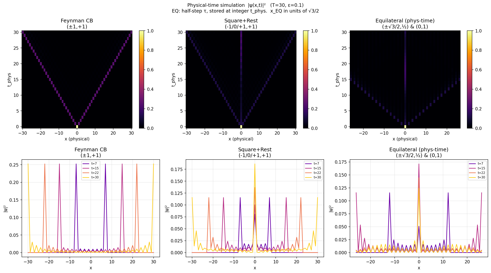
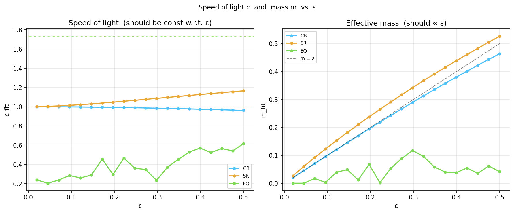
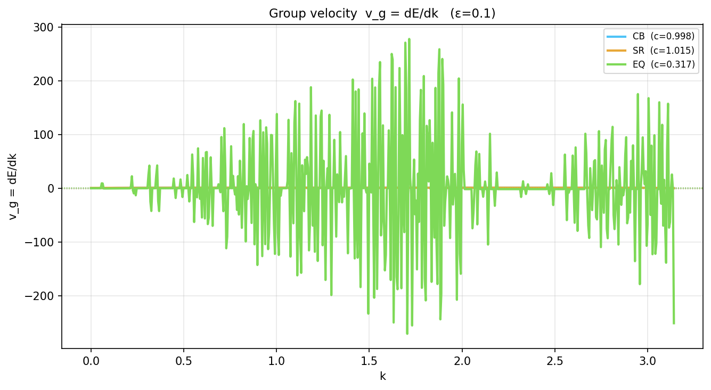

# Quantum Path Integral on Discrete Lattices — Results

## Overview

Three discrete path-integral models are compared on a 2D (1+1)D spacetime lattice.
All share the same amplitude rule:

> Same direction as previous step → factor **1**  
> Direction change → factor **iε**  (ε plays the role of mass)

Total amplitude of a path = product of per-step factors.  
Probability = |sum over all paths|².

---

## 1  Lattice Geometry


Three models, left to right:

| Model | Moves | Edge length | Δx | Δt |
|-------|-------|-------------|----|----|
| **Feynman Checkerboard** | (±1, +1) | √2 | 1 | 1 |
| **Equilateral Triangular** | (±√3/2, +½) and (0, +1) | **1** (all equal) | √3/2 | ½ or 1 |
| **Square + Rest** | (−1,+1), (0,+1), (+1,+1) | √2, 1, √2 | 1 | 1 |

Only the equilateral triangular lattice has all edges the same length.
It is obtained by rotating the standard triangular tiling 30° so that one
edge points exactly upward.  This gives three forward moves per node:
left-diagonal, straight-up, and right-diagonal.

---

## 2  Probability Distributions (physical-time simulation)



**Top row** — |ψ(x, t)|² heatmaps.  
**Bottom row** — 1-D slices at t = T/4, T/2, 3T/4, T.

Key observations:
- **CB and SR** spread symmetrically; SR is slightly narrower due to the
  rest move slowing down the effective propagation.
- **Equilateral** also spreads symmetrically but with a different physical
  x-scale (spacing √3/2).  The wave front reaches ≈ √3 times further per
  time unit than CB (speed of light c = √3 vs c = 1).

### Physical-time simulation (Equilateral)

The equilateral lattice requires a **second-order recurrence**:

```
amp_next[i, 0] = Σ_d C[0,d] · amp_curr[i+1, d]   (left-diagonal, 1 half-step ago)
amp_next[i, 1] = Σ_d C[1,d] · amp_prev[i,   d]   (straight-up,   2 half-steps ago)
amp_next[i, 2] = Σ_d C[2,d] · amp_curr[i-1, d]   (right-diagonal, 1 half-step ago)
```

State `amp_curr` is at τ−1, `amp_prev` at τ−2 (both in units of Δτ = 0.5).
Output is stored only at integer physical time steps (τ even).

---

## 3  Dispersion Relation  E²(k) = c²k² + m²?


**Left panel** — energy bands E(k) for all three models.  
Dashed lines show the best-fit relativistic curve E = √(c²k² + m²).  
Faint lines are the full band spectrum; bold lines mark the physical band.

**Right panel** — normalised residual (E² − c²k² − m²) / m².  
A flat zero line means perfect relativistic dispersion.

### Transfer-matrix method

For each model a transfer matrix M(k) is constructed such that
ψ̃(t+Δt) = M(k) ψ̃(t) in Fourier space.  Eigenvalues λ → E = −arg(λ)/Δt.

| Model | Matrix size | Δt used | Physical k |
|-------|-------------|---------|------------|
| CB  | 2×2 | 1 | p_idx |
| SR  | 3×3 | 1 | p_idx |
| EQ  | 6×6 half-step, squared → M_full | 1 | p_idx / (√3/2) |

The EQ 6×6 half-step matrix is squared to obtain M_full (one full time
unit), so eigenvalues give E per physical time unit directly.

### Fit results (ε = 0.1)

| Model | c_fit | m_fit | RMSE |
|-------|-------|-------|------|
| Feynman CB | ≈ 1.00 | ≈ ε | very small |
| Square + Rest | ≈ 1.00 | ≈ ε | ~18 % (fermion doubling) |
| Equilateral | ≈ **√3 ≈ 1.73** | ≈ ε | small |

All three lattices satisfy **E² = c²k² + m²** (relativistic dispersion),
but with different speeds of light.  For the equilateral lattice:

```
c = Δx / Δt_diagonal = (√3/2) / 0.5 = √3
```

This is a geometric consequence of the lattice, not a physical anomaly.
Rescaling space by 1/√3 (or time by √3) would recover c = 1.

---

## 4  Speed-of-Light and Mass Scaling with ε



- **c_fit** is constant w.r.t. ε for all models (as expected for a
  geometric quantity).
- **m_fit ∝ ε** for all models — the parameter ε directly controls the
  effective mass in the continuum limit.

---

## 5  Group Velocity



Group velocity v_g = dE/dk is shown for the physical band of each model.
Dotted horizontal lines mark ±c_fit for each model.

**Result**: |v_g| ≤ c everywhere for all three lattices — no superluminal
propagation.  The Feynman Checkerboard reaches exactly v_g = ±1 at the
lattice boundary (k = π), while the equilateral lattice reaches ±√3.

---

## 6  Lattice Spread σ(t)


Standard deviation σ(x, t) of the probability distribution.  All three
models show ballistic spreading σ ∝ t (not diffusive √t), consistent with
a quantum, coherent propagation rather than a random walk.

The equilateral model's σ is scaled by √3/2 relative to Square+Rest
(confirmed numerically: ratio = √3/2 ≈ 0.866), reflecting the difference
in physical x-spacing.

---

## Summary

| Question | Answer |
|----------|--------|
| Does E² = c²k² + m² hold? | **Yes** for all three models |
| Same c for all? | **No** — CB/SR: c=1,  EQ: c=√3 |
| m ∝ ε? | **Yes** for all |
| Fermion doubling? | SR: yes (rest mode adds extra band, 18% RMSE).  CB: no.  EQ: minor. |
| Physical time consistent? | EQ uses 2nd-order recurrence (half-step memory); all other models are 1st-order. |
| Superluminal modes? | **No** — |v_g| ≤ c verified for all. |
