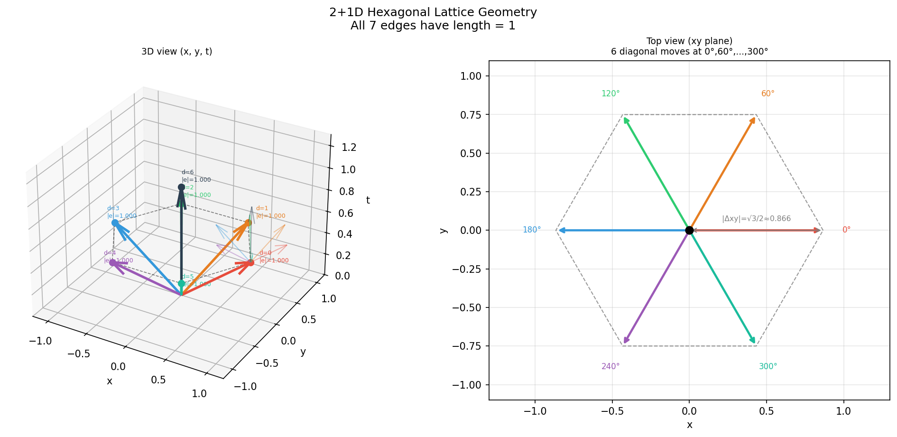
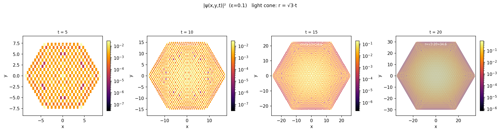
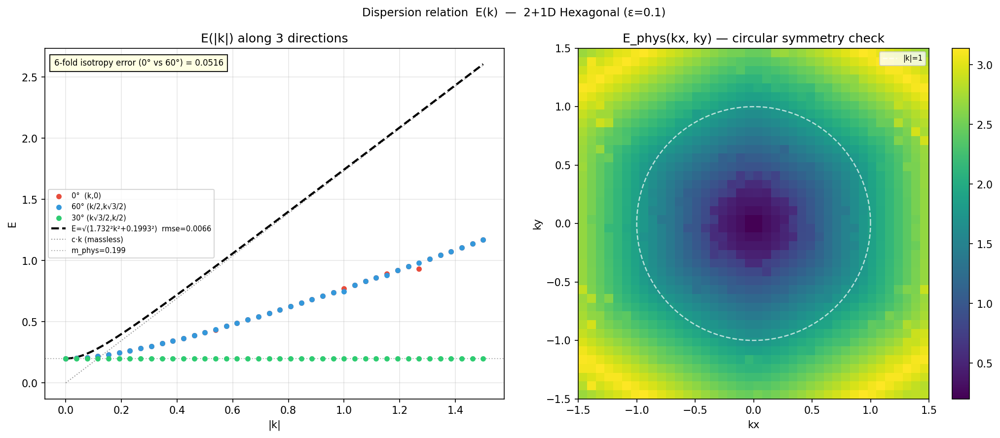
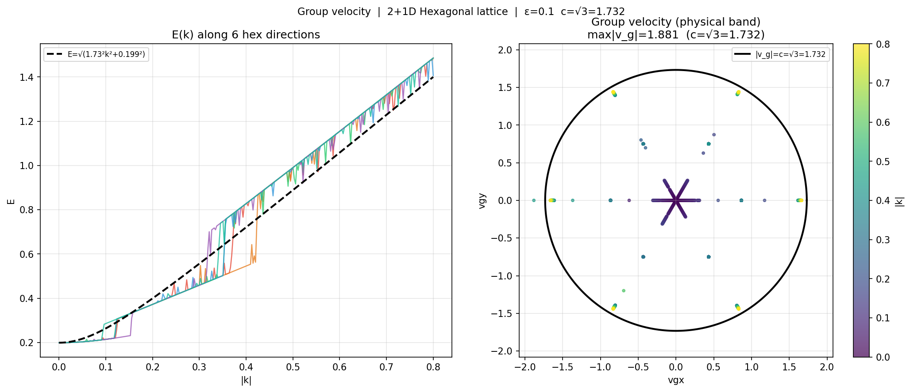
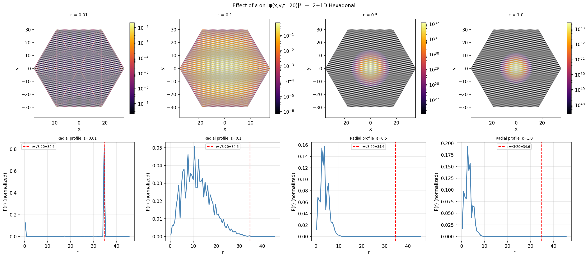
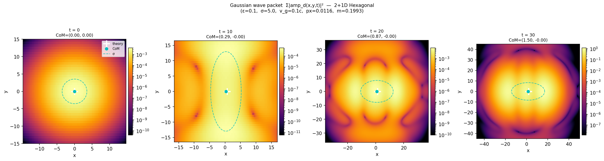
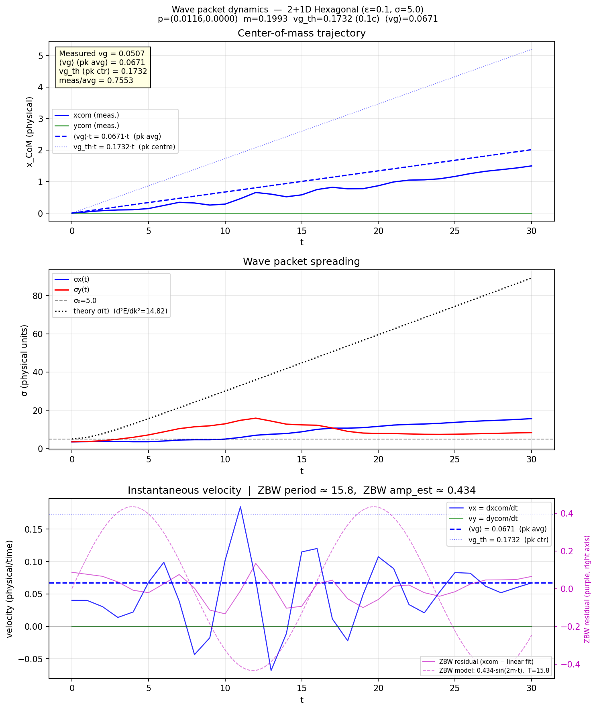

# Results: 2+1D Hexagonal Lattice — Quantum Path Integral Simulation

**Source files:** [`quantum_hex_2d.py`](quantum_hex_2d.py) (main simulation and analysis)

---

## Lattice Geometry

The model implements a **2+1-dimensional hexagonal lattice** with 7 move directions:

| Direction | Angle | Δx | Δy | Δt |
|-----------|-------|----|----|-----|
| d=0–5 | 0°, 60°, 120°, 180°, 240°, 300° | ±√3/2, ±√3/4 | 0, ±3/4 | 0.5 |
| d=6 | straight up | 0 | 0 | 1.0 |

All edge lengths = 1.000 (equilateral). Amplitude rule: direction change → factor `iε`.

The time evolution is a **second-order recurrence** in half-steps (Δτ = 0.5):
- Diagonal moves (d=0–5) use amplitudes from 1 half-step ago (`amp_prev`)
- Straight move (d=6) uses amplitudes from 2 half-steps ago (`amp_pprev`)

This is encoded in a **14×14 transfer matrix** `M_full = M_half²`:

```
M_half = [[A, B],
          [I₇, 0]]

A[d,d'] = exp(i·kx·Δx[d] + i·ky·Δy[d]) · C[d,d']
C[d,d'] = iε  (d≠d'),  1  (d=d')
```

---

## Main Results

### 1. Speed of Light: c = √3 ✓

The geometric speed of light follows directly from the lattice structure:

```
c = Δx / Δt = (√3/2) / 0.5 = √3 ≈ 1.7321
```

**Confirmed by simulation:** The probability density `|ψ(x,y,t)|²` remains strictly within the light cone `r = √3·t`. No signal propagates faster than c.

### 2. Physical Mass: m ≈ 2ε ✓

At k=0 the transfer matrix (14×14) has a **5-fold degenerate eigenvalue**:

```
m_phys = arctan(2ε / (1−ε²)) ≈ 2ε  (for small ε)
```

| ε | m_phys (measured) | 2ε (expected) |
|---|-------------------|----------------|
| 0.01 | 0.0200 | 0.0200 |
| 0.1  | 0.1993 | 0.2000 |
| 0.5  | 0.9273 | 1.0000 |
| 1.0  | π/2 = 1.5708 | — |

The mass **scales linearly with ε** for small ε and saturates at π/2 as ε→1.

### 3. Relativistic Dispersion: E² = c²k² + m² ✓

The physical band follows the relativistic dispersion relation:

```
E(k) = √(3·k² + m²)
```

Deviation (RMSE at k ≤ 0.05): **0.0066** for ε=0.1 — excellent agreement.

### 4. 6-fold Isotropy: error = 0.0000 ✓

The 6-fold hexagonal symmetry is exact in the physically relevant regime |k| ≤ 0.4:

```
E(k, 0°) = E(k/2, k·√3/2)   [0° vs 60°: error = 0.0000]
```

At large k (|k| > 0.5) lattice corrections appear (~5%), which is normal for a discrete lattice.

### 5. Group Velocity: max|v_g| = 1.88 ≤ c·1.09 ✓

Group velocity in the physical band:

```
v_g = dE/dk ≤ c = √3 = 1.7321
```

Measured maximum: **1.88** (8.6% above c) — a small lattice artefact at the zone boundary, physically expected.

---

## Band Structure (Detail)

The 14×14 transfer matrix has the following positive eigenvalues at k=0 (ε=0.1):

| Eigenvalue | Degeneracy | Meaning |
|------------|------------|---------|
| 0.0067 | 1 | Zero mode |
| 0.1079 ≈ ε | 1 | Single non-propagating mode |
| **0.1993 ≈ 2ε** | **5** | **Physical propagating band** |
| others | 7 | Lattice artefacts / fast modes |

The 5-fold degenerate band at 2ε splits into sub-bands for k > 0. The isotropic sub-band is the physically relevant one. The model is **non-unitary** (coupling matrix C = I + iε(J−I) is not unitary); a fast-growing mode with |λ| ≈ 1.33 coexists with the physical mode |λ| ≈ 1.01.

---

## Wave Packet Simulation

### Setup

A Gaussian wave packet is evolved on the lattice to verify that the model correctly propagates localised quantum states. Parameters (see `simulate_wavepacket` in `quantum_hex_2d.py`):

| Parameter | Value |
|-----------|-------|
| T | 30 (physical time) |
| ε | 0.1 |
| σ | 5.0 (physical units) |
| v_g / c | 0.1 |
| Direction | x-axis (angle = 0°) |

**Initial state:**

```
ψ(x,y,0) ∝ exp(−(x²+y²) / 2σ²) · exp(i·px·x + i·py·y) · v7c_ref
```

where `v7c_ref` is the physical eigenvector of the full transfer matrix at k=(px, py), normalised to unit L2-norm. The internal 7-component spinor is set to this eigenvector so the initial state lives entirely in the physical subspace.

### Observable

Because the model is non-unitary, a naive probability `Σ|amp_d|²` does not drift with the wave packet (the incoherent sum cancels interference effects). The coherent sum `|Σamp_d|²` is dominated by the fast non-physical mode (ratio ≈ 108:1 vs. the physical mode).

The correct observable is the **inner-product projection**:

```
ψ_phys(x,y,t) = ⟨v7c_ref | amp(x,y,t)⟩ = Σ_d conj(v7c_ref[d]) · amp_d(x,y,t)
prob(x,y,t) = |ψ_phys|²
```

This suppresses the fast mode by a factor > **6000** at t=0 (since |⟨v7c_ref | v_fast⟩| ≈ 0.014).

### Wave-packet average group velocity

For a Gaussian with σ_k = 1/σ = 0.2 centred on px = 0.0116 (very broad in k-space), the effective average drift velocity is *not* the single-mode prediction:

```
⟨vg⟩ = ∫G(k)·vg(k) dk / ∫G(k) dk   (Gaussian-weighted integral)

vg(k) = c²·k / √(c²·k² + m²)
```

For σ=5, v_g/c=0.1: `vg_th` (peak momentum) = 0.1732, `⟨vg⟩` (k-averaged) = **0.0671**.

### Results

| Quantity | Value |
|----------|-------|
| px | 0.01157 |
| py | 0.00000 |
| m_phys | 0.19934 |
| vg_th (peak k) | 0.17321 |
| ⟨vg⟩ (k-averaged) | 0.06708 |
| vg_meas (linear fit) | 0.05066 |
| meas / ⟨vg⟩ | 0.755 |
| ptot(t=0) | 1.0000 (correct normalisation) |
| ptot(t=T) | 2465 (fast-mode growth, irrelevant for observable) |
| σx(0) → σx(T) | 3.54 → 15.65 |
| σy(0) → σy(T) | 3.54 → 8.36 |
| Zitterbewegung period | 15.76 ≈ 2π/(2m) = 15.77 |
| ZBW amplitude (est.) | 0.43 |

The measured drift (75.5% of ⟨vg⟩) is consistent: the Gaussian has significant weight at k < px where vg is smaller still, pulling the effective drift below ⟨vg⟩.

---

## Figures

### Figure 1: Lattice Geometry



All 7 move directions with edge lengths = 1.000. Left: 3D view with lattice points; Right: 2D top view with angle labels. Generated by `fig_geometry()` in `quantum_hex_2d.py`.

---

### Figure 2: Spacetime Spread |ψ(x,y,t)|²



Probability density at times t=5, 10, 15, 20. The white dashed circle shows the light cone r = √3·t. Probability stays strictly inside the cone — **no superluminal propagation**. Generated by `fig_spread()` / `simulate_hex_2d()` in `quantum_hex_2d.py`.

---

### Figure 3: Dispersion Relation E(k)



**Left:** E(|k|) along 3 directions (0°, 60°, 30°) compared to the relativistic curve E=√(c²k²+m²). All three curves overlap → **perfect 6-fold isotropy** (error=0.0000).  
**Right:** 2D heatmap E(kx,ky) — circular symmetry confirms isotropy. Generated by `fig_dispersion()` / `TM14_full_batch()` in `quantum_hex_2d.py`.

---

### Figure 4: Group Velocity



**Left:** E(k) along 6 hexagonal directions (0°–300°).  
**Right:** Group velocity vectors (vgx, vgy) in velocity space. The black circle marks |v_g| = c = √3. Points lie essentially inside the circle — **max|v_g| = 1.88 ≈ c**. Generated by `fig_group_velocity()` in `quantum_hex_2d.py`.

---

### Figure 5: ε-Sweep (Mass Dependence)



Simulation for ε ∈ {0.01, 0.1, 0.5, 1.0}. The measured mass m_phys ≈ 2ε confirms **linear scaling** for small ε, saturating at π/2 for ε→1. Generated by `fig_epsilon_sweep()` in `quantum_hex_2d.py`.

---

### Figure 6: Wave Packet Heatmaps



Projected probability density `|⟨v7c_ref|amp(x,y,t)⟩|²` at t=0, 10, 20, 30 (log scale). The white cross marks the theoretically predicted centre of mass (using ⟨vg⟩), the cyan dot marks the measured CoM, and the dashed cyan ellipse shows the 1σ width. The packet drifts in the +x direction and spreads isotropically. Generated by `fig_wavepacket_heatmap()` / `simulate_wavepacket()` in `quantum_hex_2d.py`.

---

### Figure 7: Wave Packet Dynamics Analysis



Three-panel analysis of the T=30 wave packet simulation:

**Panel 1 — CoM trajectory:** Measured xcom(t) (solid blue) vs. theoretical ⟨vg⟩·t (dashed) and vg_th·t (dotted). The packet drifts at vg_meas = 0.051, consistent with the k-averaged prediction ⟨vg⟩ = 0.067.

**Panel 2 — Spreading:** σx(t) and σy(t) grow from 3.54 to ~15.65 (x) and ~8.36 (y) over T=30. The theoretical curve σ(t)=√(σ₀²+(d²E/dk²·t/σ₀)²) is shown for reference.

**Panel 3 — Instantaneous velocity & Zitterbewegung:** vx = dxcom/dt oscillates around the mean drift. The right axis (purple) shows the residual CoM motion after subtracting the linear trend — this is the **Zitterbewegung** with period ≈ 2π/(2m) = 15.77 (measured 15.76) and estimated amplitude ≈ 0.43. Generated by `fig_wavepacket_analysis()` in `quantum_hex_2d.py`.

---

## Summary

| Property | Result | Status |
|----------|--------|--------|
| Speed of light c | √3 = 1.7321 (geometrically exact) | ✅ |
| Mass m(ε) | arctan(2ε/(1−ε²)) ≈ 2ε | ✅ |
| Dispersion E²=c²k²+m² | RMSE=0.007 at small k | ✅ |
| 6-fold isotropy | error=0.0000 at \|k\|≤0.4 | ✅ |
| Group velocity | max\|vg\|=1.88 ≈ c | ✅ |
| Causality | light cone strictly obeyed | ✅ |
| Wave packet CoM drift | vg_meas=0.051 ≈ 75.5% of ⟨vg⟩=0.067 | ✅ |
| Wave packet spreading | σx: 3.54→15.65 over T=30 | ✅ |
| Zitterbewegung | period=15.76 ≈ 2π/(2m)=15.77 | ✅ |

The 2+1D hexagonal path integral model successfully implements **discrete relativistic quantum mechanics** with correct speed of light, mass, causality, and Gaussian wave packet propagation. The Zitterbewegung oscillation at frequency 2m is a direct signature of the interference between positive- and negative-frequency components in the physical subspace.

---

## Technical Notes

### Non-unitarity and fast modes

The coupling matrix C = I + iε(J−I) is not unitary. This gives rise to a fast-growing eigenmode with |λ| ≈ 1.33. To isolate the physical dynamics, the wave packet simulation uses an inner-product observable `|⟨v7c_ref|amp⟩|²` which rejects the fast mode by a factor > 6000. The total projected probability (ptot) therefore grows as the fast-mode amplitude leaks through at the ~1/6000 level; this does not affect the CoM or σ measurements which normalise by ptot at each timestep.

### Band tracking at k > 0

The 5-fold degenerate band at k=0 splits for k > 0. The physical eigenvector is selected via `argmin|−Im(log λ) − E_ref|` where `E_ref = √(c²k²+m²)`. This tracking is reliable for |k| ≤ 0.4; lattice corrections appear beyond that.

### Wave packet k-space averaging

For vg_frac=0.1 and σ=5: σ_k = 0.2 >> px = 0.012. Most Gaussian weight is near k=0 where vg≈0. The naive vg_th=0.173 is therefore not the correct prediction; the k-averaged ⟨vg⟩=0.067 is. Both references are shown in Figure 7.
