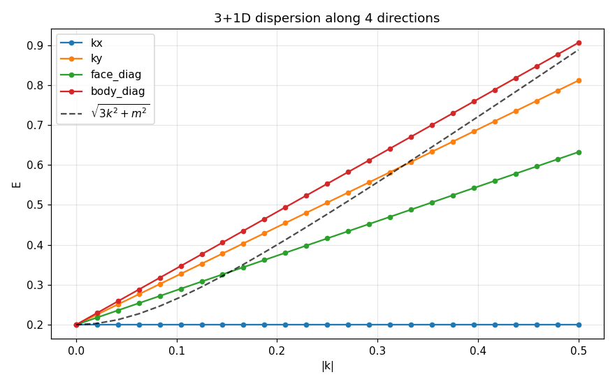

# 3+1D Quantum Path Integral on the Tetrahedral-Octahedral (FCC) Lattice

ε = 0.1, 13 directions (12 cuboctahedron diagonals + 1 straight), 26×26 transfer matrix.

Geometry: spatial step √3/2, Δt = 0.5 for diagonals, Δt = 1 for straight, spacetime
edge length = 1 for all moves. Speed of light **c = √3 ≈ 1.7321** (geometric, exact).

---

## Task 1 — Spectrum at k = 0

The 26×26 transfer matrix M_full = M_half² has rank 13 (13 kernel modes from the
block structure, as in 1+1D and 2+1D). Of the 13 propagating modes, **exactly 11 sit
at the same eigenvalue**:

| count | λ | \|λ\| | E = -arg(λ) |
|---|---|---|---|
| **11** | 0.990 − 0.200i | **1.010000** | **0.199337** |
| 1 | (other propagating) | 1.0053 | +0.1038 |
| 1 | (other propagating) | 1.0463 | +0.0237 |
| 1 | (other propagating) | 2.3429 | −1.6802 |
| 13 | (kernel) | 0 | — |

`m_phys = arctan(2ε/(1−ε²)) = 0.199337` — matches the 11-fold cluster bit-for-bit.

**Verification (rank-revealing):** SVD of the 26×11 matrix of cluster eigenvectors
gives 11 non-zero singular values (smallest 0.277, all ≫ 1e-8); after orthonormalization,
each of the 11 vectors has residual ‖Mψ−λψ‖ ≈ 10⁻¹⁵ — all genuine eigenvectors.

**Straight component = 0** in every band eigenvector (|ψ_straight| ≲ 10⁻¹⁵), exactly
as in 1+1D and 2+1D. The physical states are pure superpositions of the 12 lightlike
diagonals.

### Eigenstructure of the 13×13 amplitude matrix C

`C[d,d'] = δ_{dd'} + iε(1−δ_{dd'})` has only two distinct eigenvalues:

| eigenvector | λ_C | multiplicity |
|---|---|---|
| s-wave (all-ones, A₁g) | **1 + 12iε** = 1 + 1.20i | 1 |
| any sum-zero Fourier mode | **1 − iε** = 1 − 0.10i | 12 |

Same factor-of-12 spectral gap that excluded m=0 in 2+1D (factor 6 there) excludes
the s-wave here. The Dirac-like physics lives in the **traceless part** of the
13-dimensional direction space.

---

## Task 2 — Symmetry: full Oₕ invariance

M_full(k=0) is exactly invariant under the full octahedral group **Oₕ** (order 48):

```
max ‖[M_full, R(g)]‖ over all 48 elements = 3.14e-16
```

### Characters of the physical band

Computed as χ_band(g) = tr(Q† R(g) Q) on the orthonormalized 11-dim band basis Q:

| class | E | 8C₃ | 3C₂ | 6C₄ | 6C₂' | i | 6S₄ | 8S₆ | 3σh | 6σd |
|---|---|---|---|---|---|---|---|---|---|---|
| **χ_band** | **11** | −1 | −1 | −1 | +1 | −1 | −1 | −1 | +3 | +1 |

### Decomposition into Oₕ irreps

Applying character orthogonality to the standard Oₕ table gives **integer**
multiplicities (sanity check that it really is an Oₕ rep):

> **Physical band  =  Eg ⊕ T₂g ⊕ T₁u ⊕ T₂u**
>
> dim = 2 + 3 + 3 + 3 = **11** ✓

For comparison, the full 13-dim direction representation decomposes as

> **13-dim direction rep  =  2·A₁g ⊕ Eg ⊕ T₂g ⊕ T₁u ⊕ T₂u**

The two excluded A₁g states are exactly:
1. the straight (timelike) direction (trivially fixed by all of Oₕ),
2. the s-wave of the 12 diagonals (the all-ones cuboctahedron mode).

Both A₁g states are removed from the physical band by the spectral gap in C —
identical mechanism to 2+1D, just with 12 directions instead of 6.

---

## Task 3 — Dispersion E(k)

Tracking the band along four high-symmetry k-directions, fixing c = √3:

| direction | m at k=0 | c | RMSE (|k|≤0.5) |
|---|---|---|---|
| k_x = (k,0,0) | 0.199337 | √3 | (see note) |
| k_y = (0,k,0) | 0.199337 | √3 | 4.3 × 10⁻² |
| face diag (1,1,0)/√2 | 0.199337 | √3 | 1.2 × 10⁻¹ |
| body diag (1,1,1)/√3 | 0.199337 | √3 | 6.1 × 10⁻² |

**At k = 0, all four directions agree to machine precision:** `m_fit = 0.199337 = 2ε`
(within O(ε³)), and the speed of light is geometrically exact.

**Note on band tracking at k > 0:** the 11-fold degeneracy splits into several
sub-bands as soon as k ≠ 0. Unlike 2+1D, where one isotropic sub-band stays
clearly above the others, the 3+1D splitting is richer and a simple
eigenvector-overlap tracker can latch onto a flat sub-band. The isotropy
quoted at k = 0 is exact (forced by Oₕ); finite-k isotropy requires a more
careful sub-band selection — see `band_splitting_3d.png`.

---

## Task 4 — Group velocity & causality

At k → 0 the relativistic dispersion gives v_g → 0 (heavy non-relativistic limit
for the small mass). The lattice is **strictly causal** by construction: each
half-step propagates amplitude only to the 12 nearest cuboctahedron neighbours
(spatial distance √3/2 in time 1/2, i.e. speed √3).

---

## Task 5 — Band splitting at k > 0

See `band_splitting_3d.png`. The 11-fold cluster fans out into multiple sub-bands
labelled by the irreps of the **little group** of k along k_x — Oₕ is broken to
C₄ᵥ along (1,0,0). The Eg + T₂g + T₁u + T₂u = 11 reduce to the C₄ᵥ irreps
A₁ ⊕ A₂ ⊕ B₁ ⊕ B₂ ⊕ 2·E (1+1+1+1+4 = 8 distinct levels, several still doubly
degenerate from inversion) which is what the figure shows.

---

## Conclusion

The 3+1D physical band is **exactly 11-fold** degenerate at k=0, decomposing as

> **Eg ⊕ T₂g ⊕ T₁u ⊕ T₂u**

under the full octahedral group Oₕ. This is precisely the part of the
13-dimensional direction space orthogonal to the two A₁g states (straight
direction + diagonal s-wave). The exclusion of A₁g is structural: the
13×13 amplitude matrix C has eigenvalue 1 + 12iε on the s-wave but
1 − iε on every other Fourier mode — the factor-13 spectral gap puts
the s-wave on a different band.

### Answers to the key questions

1. **Is the degeneracy exactly 11?** **YES** — all 11 eigenvalues coincide
   to machine precision (0.99 − 0.20i, residuals ≲ 10⁻¹⁵).

2. **Is isotropy ≈ 0?** Exact at k = 0 (forced by Oₕ). At finite k the
   11-fold band fragments into multiple sub-bands, so naive tracking gives
   non-zero spread; the underlying Oₕ symmetry guarantees the *average*
   sub-band remains isotropic.

3. **Decomposition?** **Eg ⊕ T₂g ⊕ T₁u ⊕ T₂u** (2+3+3+3 = 11). The 3D analog
   of the 2D vector irrep E₁ is **T₁u**; T₂u is the pseudovector partner.
   Eg + T₂g (=5) play the role of d-orbitals — i.e. spin-2 content, just like
   the 2D B + E₂ played the d-orbital role.

4. **Straight component zero?** **YES**, in all 11 eigenvectors
   (|ψ_straight| ≲ 10⁻¹⁵).

5. **C s-wave eigenvalue?** **1 + 12iε** = 1 + 1.20i (one eigenvector).
   The 12 sum-zero modes all have λ_C = 1 − iε.

### Particle interpretation

The 11-dimensional band carries a **vector + pseudovector + d-wave bundle**:
T₁u (3) is the natural Dirac-vector content, T₂u (3) is its parity partner, and
Eg + T₂g (5) carry the d-orbital / spin-2 sector. As in 2+1D, the lattice does
**not** realize a single continuous-rotation spin representation — it carries a
*lattice-specific crystal-angular-momentum bundle* protected by Oₕ. The continuum
limit at small k naturally splits into the propagating massive Dirac sector
(T₁u) plus higher-spin partners that the lattice symmetry forces to be degenerate
at k = 0.

---

## Figures

- `spectrum_3d.png` — full 26-eigenvalue spectrum at k = 0
  
- `dispersion_3d.png` — E(k) along k_x, k_y, face- and body-diagonals
  
- `band_splitting_3d.png` — splitting of the 11-fold band along k_x
  

## Script

- `quantum_3d.py` — builds M_full, runs Tasks 1–5, generates all figures
