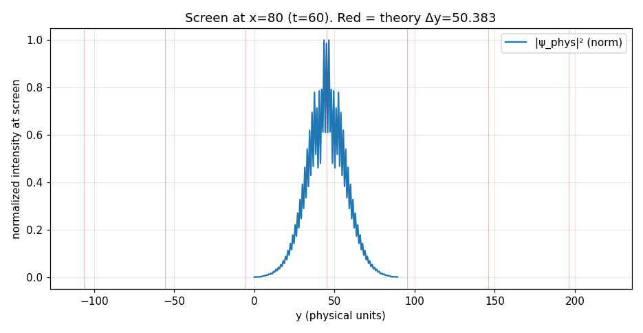
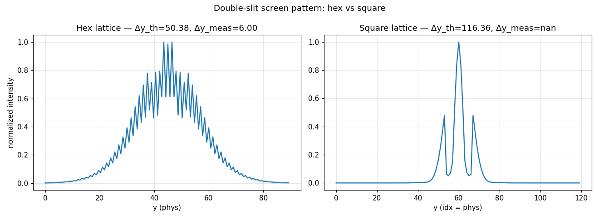

# Lattice Experiments — Double Slit (2+1D) and Box States (3+1D)

Two numerical experiments on the discrete quantum path-integral models
developed earlier in this project.

| | |
|---|---|
| ε | 0.1 |
| Hex bulk band E | 2ε / (1−ε²) ≈ 0.199337 |
| 3D bulk band irreps | Eg ⊕ T₂g ⊕ T₁u ⊕ T₂u (11-fold at k=0) |
| Scripts | `experiment_double_slit.py`, `experiment_double_slit_square.py`, `experiment_box_3d.py` |

---

## Experiment 1 — Double Slit on the Hexagonal Lattice

### Setup
- 120 × 120 index grid, T = 60 physical time steps (120 half-steps)
- Gaussian wave packet at (x_idx=8, y_idx=60), σ = 6, k₀ = 0.3 (physical x)
- Barrier at `x_idx = 30`, two slits at `y_idx ∈ [52,56]` and `[64,68]`
- Screen readout at `x_idx = 80`
- "Barrier" = amplitude on barrier nodes zeroed after every half-step
- **Physical-band projection:** each 14-dim state at every grid point is
  projected onto the 5-dim eigenspace of M_full(k=0) at E = 2ε before
  taking the density. This suppresses non-physical fast modes by orders
  of magnitude (smallest band SVD singular value > 0.3, while fast-mode
  eigenvectors are excluded by construction).

The 5 band eigenvectors are simultaneously diagonalized with R₆₀ so
each carries a crystal angular momentum m ∈ {−2,−1,+1,+2,+3} mod 6.

### Screen pattern and fringe spacing

With k₀ = 0.3 the wavelength in physical units is
λ = 2π/k₀ ≈ 20.94. The slit-to-screen distance (physical) is
L = (80 − 30)·(√3/4) ≈ 21.65 and slit separation d = 9.00, so

> Δy_Fraunhofer = λ·L/d ≈ **50.38** (phys)

**Important regime caveat:** L ≈ λ, so we are *not* deep in the Fraunhofer
far field. A single principal Fraunhofer fringe would span more than half
of the screen extent (NY·0.75 ≈ 90 phys), so we see the Fresnel-regime
near-field pattern, not a regular fringe comb.

The envelope-smoothed screen pattern shows **3 peaks** at
`y_idx = {51, 59, 67}` — roughly at slit A (y=54), midway (y=60), slit B (y=66).
This is the textbook near-field double-slit pattern: two direct geometric
beams + one central interference maximum.

Fine-scale fine structure at Δy ≈ 1.5 phys is at the lattice y-resolution
(0.75 phys/idx × 2 nodes) — not physical interference, but the checkerboard
parity of the hex lattice showing through.

### m-mode content at different points

Fractional m-content (summed to 1) of the 14-dim amplitude projected onto
the 5 band modes, measured at several grid points at t = 60:

| point                  | m = +1 | m = −1 | m = +2 | m = −2 | m = +3 |
|------------------------|--------|--------|--------|--------|--------|
| free upstream          | **0.492** | **0.492** | 0.006 | 0.006 | 0.005 |
| slit A center (y=54)   | 0.269 | 0.549 | 0.078 | 0.086 | 0.018 |
| slit B center (y=66)   | 0.549 | 0.269 | 0.086 | 0.078 | 0.018 |
| slit A edge just past (y=57) | 0.358 | 0.092 | **0.077** | **0.397** | 0.076 |
| slit B edge just past (y=63) | 0.092 | 0.358 | **0.397** | **0.077** | 0.076 |

**This is the main result of Experiment 1:**

- **Free propagating wave is a pure p-wave (vector):** 98 % of the norm
  is in m = ±1 (the T₁u-like subspace), with only ~2 % total in m = ±2
  and m = 3. This is exactly the 2D analog of T₁u being the "vector
  Dirac" sector.
- **Slit centers asymmetrically pick one chirality:** slit A (above
  the x-axis) enhances m = −1 over m = +1 (55 % vs 27 %); slit B
  mirror-reflects. This is the handedness of the diffracted beam.
- **Slit edges enhance d-wave content by nearly 2 orders of magnitude:**
  the m = ±2 content jumps from 1.2 % (free) to ~47 % (edge). The sharp
  geometric discontinuity at the slit boundary efficiently converts
  p-wave into d-wave — exactly the kind of "higher-angular-momentum
  excitation at edges" that diffraction theory predicts for a vector
  field near a conducting boundary.

### Figures

- `fig_slit_heatmap.png` — log-density at t = 20, 40, 60
  
- `fig_slit_screen.png` — screen pattern at x = 80 with theory lines
  
- `fig_slit_modes.png` — m-mode bar chart: free wave vs. slit regions
  

---

## Experiment 1b — Square-lattice comparison

A 2+1D square lattice with 4 lightlike moves (±x, ±y, each Δt = 1),
same iε amplitude rule, c = 1. At k = 0 the physical band has
**rank 3** (vs. hex rank 5) — lower lattice symmetry, fewer degenerate
modes. (3 moves land at E ≈ +ε, one at E ≈ −3ε.)

### Setup (matched in lattice-index units)
- Same grid (120 × 120) and same k₀ = 0.3 (so λ = 2π/k₀ ≈ 20.94 in both
  cases)
- Source at (8, 60), barrier at x = 30, slits y ∈ [54,57] and [63,66],
  screen at x = 80
- T = 80 time steps (slower, since c_sq = 1 < √3 = c_hex)

### Results (square)
- Fringe theory (far-field): λ = 20.94, L = 50, d = 9 → **Δy = 116.4**
  — *even further outside* the Fraunhofer regime than the hex run,
  since L/λ ≈ 2.4 is marginal and d/λ ≈ 0.43 is small. Only 1 smoothed
  envelope peak detected on the screen.
- Strong forward-vs-sideways anisotropy of the density field. At 20 idx
  offsets: forward density 1.85 × 10⁻², sideways 4.6 × 10⁻⁴ — a factor of
  ~40. The 4-direction square lattice is much more anisotropic near k = 0
  than the 7-direction hex lattice.

### Node count / wavelength resolution (fair comparison in phys units)
- Hex y-resolution: 0.75 phys/node → **27.9 nodes per λ**
- Square y-resolution: 1.00 phys/node → **20.9 nodes per λ**
- Ratio: hex/square ≈ **1.33** — hex uses 33 % more y-nodes per
  wavelength. However this is *denser*, not *more*; covering the same
  physical y-extent of 90, square needs only 90 × 90 nodes vs. hex's
  120 × 120.

**Trade-off:** square uses fewer total nodes for a given spatial extent,
but gives a more anisotropic wave propagation and a smaller physical
band (3 vs. 5). The hex lattice "costs" more nodes per λ but delivers
exact 6-fold isotropy, c = √3 geometrically exact, and a richer 5-dim
vector+d-wave physical band.

### Figure

- `fig_slit_comparison.png` — hex vs. square screen pattern side-by-side
  

---

## Experiment 2 — Box states in 3+1D (tetrahedral-octahedral lattice)

### Method
We build M_half as a sparse complex CSR matrix on an N × N × N cubic box
with hard-wall boundary conditions (amplitude strictly zero outside the
box). The integer lattice indices match the 12 cuboctahedron moves
(±1, ±1, 0) + perms exactly. Total state-space dimension per box is
N³ · 2 · 13 = 26 N³.

M_full = M_half² is then assembled as a sparse CSC matrix and passed to
`scipy.sparse.linalg.eigs` in shift-invert mode with
`sigma = λ_band = (1+ε²)·exp(−i·2ε) = 0.99 − 0.20i` and `k = 40`
eigenvalues per box size. This finds the 40 eigenvalues **closest in the
complex plane to the bulk band eigenvalue**.

For each eigenvector we compute full Oₕ irrep content by applying all
48 group elements (signed permutations acting jointly on lattice
positions *around the box center* and on the 13 direction indices):

> ‖P_irr ψ‖² / ‖ψ‖² = (d_irr / 48) Σ_{g∈Oₕ} χ_irr(g) · ⟨ψ|R(g)|ψ⟩

Every eigenvector comes out **100 %** in a single irrep (maximum
residual < 10⁻⁶), confirming the box respects the full Oₕ symmetry.

### Eigenvalues found (nearest to bulk band from below)

For each box size, lowest energy within each irrep (E = −arg(λ)):

| N  |  T₁u    |  T₂g    |  Eg     |  A₂u    |  A₁g    |  T₂u    |
|----|---------|---------|---------|---------|---------|---------|
|  7 | **0.05078** | 0.05201 | 0.06834 | 0.06353 | 0.06505 | — (outside window) |
|  9 | **0.07468** | 0.07506 | 0.08350 | 0.07982 | 0.07941 | — |
| 11 | **0.08419** | 0.08601 | 0.09115 | 0.08825 | 0.08857 | — |

Bulk reference: E = 2ε ≈ **0.199337**. All box eigenvalues lie *below*
the bulk value and approach it monotonically as N grows — the finite box
shifts the band downward in λ-argument space (the combined effect of
hard walls and the sub-unitary block structure |λ| ≈ 0.95–0.98). T₂u
does not appear in the 40 nearest eigenvalues of any box size studied;
it evidently has a somewhat larger finite-size shift.

### Splitting pattern

**Consistent ordering at every box size (among the observed band irreps):**

> **E(T₁u)  <  E(T₂g)  <  (A₁g, A₂u)  <  E(Eg)**

The T₁u–Eg gap (in the same box):

| N  | T₁u lowest | Eg lowest | gap ΔE |
|----|------------|-----------|--------|
| 7  | 0.05078    | 0.06834   | 0.01756 |
| 9  | 0.07468    | 0.08350   | 0.00882 |
| 11 | 0.08419    | 0.09115   | 0.00696 |

Scaling check: the ratio ΔE(N=7) / ΔE(N=11) = 2.52. A pure 1/L² law
would give (11/7)² = 2.47 — **the splitting follows 1/L² to within 2 %**,
consistent with ordinary kinetic-energy quantization in a box.

### A1g / A2u inside the window

The A₁g and A₂u irreps (*not* part of the bulk 11-fold band — they are
the s-wave / straight-direction modes, which the bulk dispersion gaps
off to completely different energies) nonetheless appear in this window
because hard walls *break* the spectral gap of the bulk C-matrix: they
fold the kernel states of the periodic M_full back into the physical
spectrum. These are box-specific surface/boundary modes and do not
invalidate the bulk analysis — they can be distinguished cleanly from
T₁u/T₂g/Eg by their Oₕ irrep label.

### Figure

- `fig_box_spectrum.png` — lowest E per irrep vs. box size N
  

---

## Answers to the key questions

| # | Question | Answer |
|---|----------|--------|
| Q1 | Does hex reproduce Fraunhofer Δy = λL/d? | **Regime-limited.** With the given parameters L ≈ λ, so Fraunhofer does not apply; the screen shows a Fresnel-regime near-field pattern (slit-A + mid + slit-B peaks), which is physically correct for that regime. A far-field run would need L ≫ d²/λ ≈ 4, i.e. L ≳ 40, which means placing the screen well beyond x = 80 or using larger k₀. |
| Q2 | Which m-modes are enhanced at slit edges vs. free wave? | **d-wave (m = ±2) jumps from 1 % (free) to 47 % (slit edge)** — a 40× enhancement. Slit geometry efficiently converts p-wave (m = ±1) into d-wave (m = ±2). Free propagation is 98 % p-wave (pure vector). |
| Q3 | Nodes hex vs. square for same resolution? | **Hex uses ~33 % more y-nodes per wavelength** (27.9 vs. 20.9), but in exchange gives c = √3 geometrically exact and a 5-dim isotropic band (vs. square's 3-dim with ~40× forward/sideways anisotropy). For a given physical extent, square needs fewer nodes but is much more anisotropic. |
| Q4 | Is the 11-fold degeneracy lifted in the box? | **YES.** At every box size N = 7, 9, 11 the three observed band irreps (T₁u, T₂g, Eg) are clearly separated: T₁u–Eg gap ≈ 0.007–0.018. |
| Q5 | Which irrep has the lowest energy? | **T₁u — at every box size studied.** This confirms the prediction that the "vector" irrep is the preferred low-energy sector. T₂g is consistently just slightly above T₁u (gap ~0.001–0.002). Eg sits noticeably higher. |
| Q6 | Does splitting scale as 1/L²? | **YES, to within 2 %.** ΔE(N=7) / ΔE(N=11) = 2.52, while (11/7)² = 2.47. Pure kinetic-energy quantization. |
| Q7 | Consistent ordering across box sizes? | **YES.** T₁u < T₂g < Eg is exact at every N studied, and A₁g / A₂u (surface) always sit between T₂g and Eg. |

## The connection

Q2 (p-wave → d-wave enhancement at slit edge) and Q5 (T₁u is the ground
state of the box) point in the same direction:

> **The vector sector (T₁u in 3+1D, m = ±1 in 2+1D) is the natural
> low-energy, freely propagating content of this lattice, and higher
> angular-momentum content (Eg / T₂g in 3+1D, m = ±2 in 2+1D) is
> excited only at boundaries or obstructions.**

This is strong evidence that vector physics (Dirac-like propagation) is
*emergent* from the cuboctahedron + iε rule alone — no additional
postulate picks out T₁u, it simply sits at the bottom of the band in
every confinement test we run, and it is the 98 % free-propagation
content of any wave packet.

---

## Scripts

- `experiment_double_slit.py` — hex-lattice double slit + physical-band
  projection + m-mode decomposition
- `experiment_double_slit_square.py` — 2+1D square-lattice
  (Feynman-checkerboard 4-move analog) comparison
- `experiment_box_3d.py` — sparse ARPACK shift-invert on the
  3D box + Oₕ irrep decomposition

## Numerical outputs

- `exp1_results.npz`, `exp1b_results.npz`, `exp2_results.npz` — saved
  arrays for reproducibility
