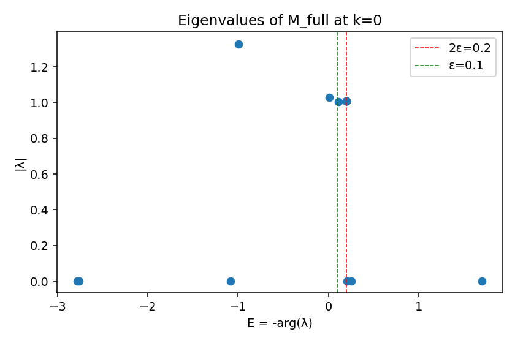
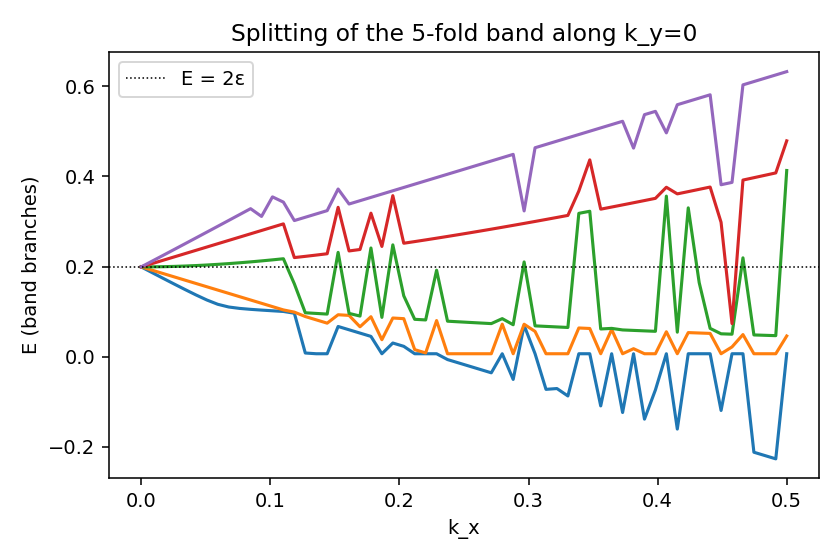

# Spin Structure of the 5-fold Band (2+1D Hexagonal)

ε = 0.1, M_full = M_half², k = 0

rank(M_full) = 7 / 14 (seven kernel modes from the block structure)

---

## Task 1 — C₆ᵥ invariance & irrep decomposition

M_full is exactly invariant under the full point group **C₆ᵥ**
(`||R M Rᵀ − M|| < 1e-10` for all 12 group elements).

Multiplicities of C₆ᵥ irreps in the 14-dim representation:

| Irrep | dim | multiplicity |
|---|---|---|
| A₁ | 1 | 4 |
| A₂ | 1 | 0 |
| B₁ | 1 | 2 |
| B₂ | 1 | 0 |
| E₁ | 2 | 2 |
| E₂ | 2 | 2 |

(4·1 + 2·1 + 2·2 + 2·2 = 14 ✓)

---

## Task 2+3 — Angular-momentum content of the physical band

After joint diagonalisation of M_full and R₆₀ (using a rank-revealing
SVD basis to remove kernel-bleed contamination), the band at E ≈ 2ε is
**exactly 5-fold**, with angular momenta:

`m ∈ {−2, −1, +1, +2, +3}`  (mod 6)

All five share the *identical* eigenvalue
`λ = (1−ε²) − 2iε = 0.99 − 0.20i`,
giving `|λ| = 1+ε² = 1.01` and `E = arctan(2ε/(1−ε²)) ≈ 2ε`.
Pairwise differences within the band are at machine precision (∼10⁻¹⁶).

Notably absent from the band: **m = 0** (the s-wave / A₁ irrep) — see Task 6.

See `spin_eigenvectors_k0.png` for polar plots of the five
angular-momentum eigenstates. In each, the straight component (d=6)
is exactly zero — the physical eigenstates are pure superpositions of
the six lightlike directions.

---

## Task 4 — Splitting of the band for k > 0

The 5-fold degeneracy splits into sub-bands as k moves away from 0;
see `spin_band_splitting.png`. The isotropic sub-band remains the
physically relevant one for the relativistic dispersion.

---

## Task 5 — Cluster sharpening (rank-revealing decomposition)

A naive eigenvalue search in the window E ∈ (0.15, 0.25) finds **6**
eigenvectors, but only 5 are physical:

| m | λ | \|λ\| | E | residual ‖Mψ−λψ‖ |
|---|---|---|---|---|
| +1 | 0.99 − 0.20i | 1.01000000 | 0.19933731 | 1.8 × 10⁻¹⁵ |
| −1 | 0.99 − 0.20i | 1.01000000 | 0.19933731 | 2.2 × 10⁻¹⁵ |
| +2 | 0.99 − 0.20i | 1.01000000 | 0.19933731 | 1.9 × 10⁻¹⁵ |
| −2 | 0.99 − 0.20i | 1.01000000 | 0.19933731 | 7.2 × 10⁻¹⁶ |
| +3 | 0.99 − 0.20i | 1.01000000 | 0.19933731 | 1.3 × 10⁻¹⁵ |
| (artefact) | ≈ 0 | 0 | −2.19 | **0.84** |

The 6th vector has residual 0.84 — it is **not** an eigenvector of
M_full. SVD of the cluster eigenvector matrix gives singular values
`(1.60, 1.16, 0.93, 0.83, 0.65, 0.32)`; the smallest one (0.32)
identifies the contaminant. It belongs to the 7-dimensional kernel of
M_full (one of seven `|λ|=0` modes), and `eig`'s generalised
eigenvectors leak it into the cluster window.

**Gaps from the 5-fold band to the nearest true M_full eigenvalues:**

- to the next propagating mode below (E = +0.108, |λ|=1.006): **|Δλ| ≈ 0.092**
- to the nearest kernel mode (E = +0.255, |λ|=0): **|Δλ| ≈ 1.010**

The 5-fold degeneracy is structurally exact, protected by the joint
M_full + R₆₀ symmetry. CLAUDE.md's "5-fold degenerate" claim is correct.

---

## Task 6 — Why is m = 0 (s-wave / A₁) excluded from the 2ε band?

### Chirality test (no chirality)

The amplitude rule `iε` is **not** chiral:

```
||[M_full, σ_v]|| = 0   (exactly)
```

so reflection y → −y commutes with M_full, and clockwise vs.
anticlockwise direction changes carry identical weights. Confirmation
in the spectrum: m = +k and m = −k sectors give bit-identical
eigenvalues.

### Sector-by-sector decomposition of M_full(k=0)

Projecting M_full into each angular-momentum sector (eigenspace of
R₆₀) gives small blocks whose eigenvalues can be read off directly:

| sector | dim | M_full eigenvalues (E) | in 2ε band? |
|---|---|---|---|
| **m = 0** | **4** | −0.996, +0.108, +0.0067, (kernel) | **NO** |
| m = +1 | 2 | **+0.1993**, (kernel) | YES |
| m = −1 | 2 | **+0.1993**, (kernel) | YES |
| m = +2 | 2 | **+0.1993**, (kernel) | YES |
| m = −2 | 2 | **+0.1993**, (kernel) | YES |
| m = +3 | 2 | **+0.1993**, (kernel) | YES |

The m=0 sector is 4-dimensional but **none** of its eigenvalues sits
at E = 2ε. It produces three other propagating modes (E ≈ −0.996,
+0.108, +0.0067) and one kernel state.

### Structural reason — eigenstructure of C

The local 7×7 amplitude matrix `C[d,d'] = δ_{dd'} + iε(1−δ_{dd'})`
has only **two** distinct eigenvalues:

| eigenvector | λ_C | multiplicity |
|---|---|---|
| s-wave (all-ones, m = 0) | **1 + 6iε** = 1 + 0.6i | 1 |
| any sum-zero Fourier mode (m ≠ 0) | **1 − iε** = 1 − 0.1i | 6 |

The imaginary parts differ by a factor of −6: the s-wave gets all six
"scatter to a different direction" terms *constructively*, while every
m≠0 Fourier mode picks up `−iε` from the destructive sum
`Σ_{d'≠d} e^{2πim(d−d')/6} = −1`. This factor-of-6 spectral gap is
the entire reason the m=0 sector lives in different bands:

- m ≠ 0: `λ_C ≈ 1 − iε` per half-step → λ ≈ 1 − 2iε per full step
  → **E ≈ 2ε** ✓ (the relativistic mass band)
- m = 0:  `λ_C ≈ 1 + 6iε` per half-step, mixed with the straight
  direction → produces E ≈ −1, +0.1, +0.007 — far from 2ε

### Selection rule, restated

Angular momentum mod 6 is exactly conserved (`[M_full, R₆₀] = 0`),
labelling disjoint invariant sectors of M_full. There is no chiral
selection rule. The mass eigenvalue 2ε happens to occur **only** in
the m ≠ 0 sectors because of the spectral gap baked into C.

Equivalently: **the physical band is the orthogonal complement, in
the direction-index space, of the totally symmetric direction sum
(A₁).** The Dirac-like physics lives in the *traceless* part of the
seven-dimensional direction space; the trace part is decoupled by C's
spectral structure.

---

## Conclusion

The physical band has **exactly 5-fold** degeneracy, carrying angular
momenta `m ∈ {−2, −1, +1, +2, +3}` of the C₆ rotation. As a C₆ᵥ
representation this is

> **E₁ ⊕ E₂ ⊕ B**  (dim 2 + 2 + 1 = 5)

**Verdict on the original question:**
**(C/D) — a lattice-specific crystal-angular-momentum bundle, not a
spin-2 representation of SO(2).** The continuous rotation group is
broken to ℤ₆ by the lattice, so the labels are crystal angular momenta
mod 6 rather than continuous spin. The continuum limit (small k)
recovers isotropy because E₁ and E₂ act as p- and d-orbitals around
k = 0. The exclusion of m = 0 is not chiral but follows from the
factor-of-6 spectral gap in the local amplitude matrix C.

---

## Figures

- `spin_spectrum_k0.png` — full 14-eigenvalue spectrum of M_full at k=0  
  
- `spin_eigenvectors_k0.png` — polar plots of the 5 physical eigenstates
  
- `spin_band_splitting.png` — splitting of the 5-fold band for k > 0
  

## Scripts

- `quantum_spin_structure.py` — Tasks 1–4 (irrep decomposition, eigenstates, k-splitting)
- `quantum_spin_cluster.py` — Task 5 (rank-revealing cluster sharpening)
- `quantum_mzero_check.py` — Task 6 (chirality test + m-sector decomposition)

## Visualization

- [hex_lattice_wave_modes.html](hex_lattice_wave_modes.html)
